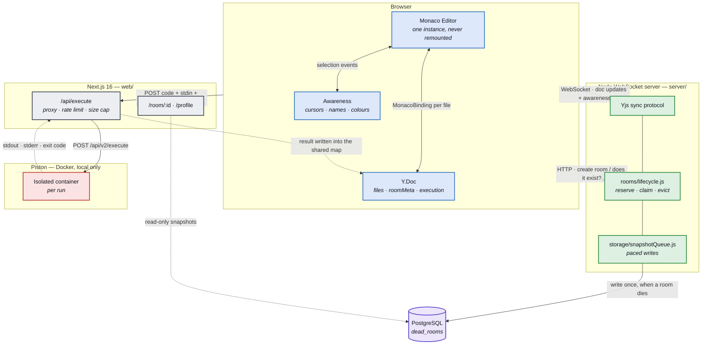
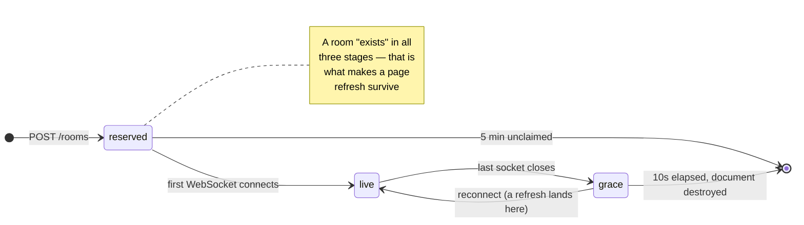
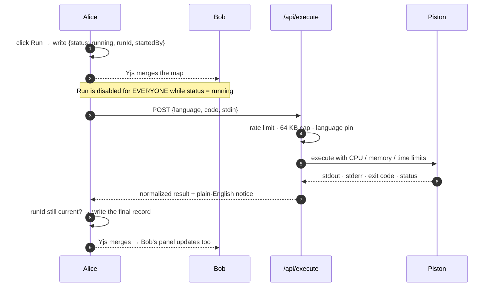

<div align="center">

# CollabCode

### A real-time collaborative code editor with sandboxed multi-language execution

**Open a room. Share the link. Type together. Run the code — everyone sees the output.**

<br/>

[](https://nextjs.org/)
[](https://react.dev/)
[](https://www.typescriptlang.org/)
[](https://tailwindcss.com/)

[](https://yjs.dev/)
[](https://nodejs.org/)
[](https://neon.tech/)
[](https://github.com/engineer-man/piston)

<br/>


[](LICENSE)

<br/>

[Why it isn't deployed](#a-note-on-deployment-please-read-first) ·
[Overview](#overview) ·
[Features](#features) ·
[Architecture](#architecture) ·
[Quick start](#quick-start) ·
[Usage](#usage) ·
[Security](#security-considerations)

</div>

---

## A note on deployment (please read first)

> [!IMPORTANT]
> **This application is fully functional when run locally. It is deliberately not deployed to a
> public URL, and that is a decision rather than an unfinished task.**

The blocker is the **code execution sandbox**, and only that. Everything else — the editor, the
real-time sync server, accounts, and the Postgres snapshot store — is host-ready today.

Running untrusted code safely requires [Piston](https://github.com/engineer-man/piston), and there
are exactly two ways to get it:

| Option | Why it does not work here |
| :-- | :-- |
| **The public Piston API** (`emkc.org`) | Went **whitelist-only**, and now rejects every unapproved request. It is not a fallback. |
| **A self-hosted Piston instance** | Needs a **privileged** Docker container (`isolate`, cgroups, `tmpfs … :exec`). Managed platforms such as Vercel and Railway do not allow that, so it needs a **VPS** — which I do not currently have. |

There was a third option, and I removed it on purpose. Piston once ran on my own machine and was
bridged to the internet through a tunnel. That tunnel exposed `POST /api/v2/execute` **with no
authentication at all**, to a container running with the full Linux capability set — meaning the
sandbox was the only thing between a stranger's code and root on a personal computer. It also
bypassed the app's rate limiter entirely, since the limiter lives in front of the app and the
tunnel went straight to Piston.

**Exposing a personal machine that way is not a risk worth taking for a demo, so the tunnel was
shut down and Piston is now bound to `127.0.0.1`. Deployment is intentionally omitted until a
proper VPS is available.**

**What this means for you:** [running it locally](#quick-start) takes three commands and gives you
the complete application, execution included. Nothing is stubbed, mocked, or disabled in the local
build.

**Want to deploy it anyway?** [`docs/DEPLOYMENT.md`](docs/DEPLOYMENT.md) is a step-by-step guide for
both paths — a single VPS where everything works including Run, and managed hosting where it does
not — with the security setup each one needs.

<!-- ───────────────────────────────────────────────────────────────
     SCREENSHOT SLOT — hero
     Add docs/screenshots/hero.png, then uncomment the block below.

<div align="center">
  
</div>
──────────────────────────────────────────────────────────────── -->

---

## Overview

Pair programming, technical interviews, and classroom coding usually happen over a screen share
with **no shared, executable environment**. One person types; everyone else watches and reads code
aloud.

CollabCode replaces that with a room you share by URL:

| | |
| :-- | :-- |
| **Everyone types at once** | Concurrent edits merge without conflicts — CRDTs, not locks or turn-taking. |
| **You can see where everyone is** | Live cursors, live selections, coloured name labels. |
| **Anyone can hit Run** | The result lands in *everyone's* output panel, not just the clicker's. |
| **Untrusted code runs in a real sandbox** | Isolated containers with CPU, memory, and output ceilings — never `eval()` in the browser. |
| **The room dies when the last person leaves** | Guests store nothing at all. Sign in, and a room you actually worked in is snapshotted **once**, read-only, to your profile. |

> **The two genuinely hard problems this project is about:** keeping edit state consistent across
> concurrent users without merge conflicts, and running arbitrary untrusted code without
> compromising the host. Most tutorial projects skip both — they fake sync with "last write wins"
> and fake execution with `eval()`.

### Project status

| Area | State |
| :-- | :-- |
| Real-time editing, presence, room lifecycle | Complete |
| Multi-file rooms, sandboxed execution, stdin, shortcuts | Complete |
| Accounts, dead-room snapshots, profile page | Complete |
| Test suite | 295 tests across four tiers, plus CI |
| Public deployment | [Intentionally omitted](#a-note-on-deployment-please-read-first) |
| In-room chat, room passwords, room names | [Planned](#future-improvements) |

---

## Features

<table>
<tr><th align="left" width="230">Feature</th><th align="left">What it does</th></tr>

<tr><td><b>Room links</b></td><td>Create a room or paste a link to join. Room IDs are <code>crypto.randomUUID()</code> — unguessable, and <b>minted by the server</b>, so an ID nobody was ever issued is refused the moment it tries to connect.</td></tr>

<tr><td><b>Guest-first identity</b></td><td>First name, last name, and a palette colour. No account required. Stored per browser tab, so a second tab is a genuinely separate collaborator.</td></tr>

<tr><td><b>Conflict-free editing</b></td><td>Monaco bound to a Yjs <code>Y.Text</code>. Two people typing on the same line converge to the same result on every screen.</td></tr>

<tr><td><b>Live cursors and selections</b></td><td>Every peer's caret and selection is rendered in their own colour with a name label, over Yjs's awareness protocol.</td></tr>

<tr><td><b>Presence stack</b></td><td>Who is in the room right now. Duplicate names get numbered (<code>Naman S1</code> / <code>Naman S2</code>) and duplicate colours get reassigned — resolved identically on every client, with no coordination.</td></tr>

<tr><td><b>Multi-file rooms</b></td><td>Up to <b>20 files</b> per room, with tabs, rename, delete, and a starred <b>entry file</b> — the one that Run executes.</td></tr>

<tr><td><b>Five languages</b></td><td>JavaScript · Python · TypeScript · Java · C++, chosen <b>once when the room is created</b> and fixed for its lifetime. It drives syntax highlighting, the sandbox runtime, and every file's extension.</td></tr>

<tr><td><b>Shared execution</b></td><td>Run streams stdout, stderr, and the exit code to <b>everyone in the room</b>, captioned with who ran it, which file, and in which language.</td></tr>

<tr><td><b>Standard input</b></td><td>An stdin box for programs that read input. What you type stays local until you Run; the input that produced a result travels with the result, so everyone can see it.</td></tr>

<tr><td><b>Keyboard shortcuts</b></td><td><kbd>Ctrl/Cmd</kbd>+<kbd>Enter</kbd> to run, <kbd>Ctrl/Cmd</kbd>+<kbd>S</kbd> to save.</td></tr>

<tr><td><b>Save to device</b></td><td>One file downloads with the correct extension (<code>main.py</code>, <code>main.cpp</code>, <code>Main.java</code>…); two or more become <code>project.zip</code>. Entirely local — nothing is uploaded.</td></tr>

<tr><td><b>Resizable room layout</b></td><td>Drag the editor/output split, flip it between side-by-side and stacked, collapse the output. Sizes persist; phones get a forced stack.</td></tr>

<tr><td><b>Light and dark themes</b></td><td>Light / System / Dark, with no flash of the wrong theme on first paint.</td></tr>

<tr><td><b>Optional accounts</b></td><td>Clerk sign-in is additive — every guest path works untouched. Signing in buys exactly one thing: persistence.</td></tr>

<tr><td><b>Dead-room snapshots</b></td><td>When a room dies, its final files are written <b>once</b> to Postgres — but only for signed-in participants who stayed and actually edited. Fully-guest rooms save nothing at all.</td></tr>

<tr><td><b>Read-only profile</b></td><td><code>/profile</code> lists your past rooms and lets you view, copy, download, or delete the code. Never run it, never rejoin it.</td></tr>

<tr><td><b>Leaving warning</b></td><td>The last person in a room is warned before closing the tab, with a live chip estimating whether their work will survive.</td></tr>

<tr><td><b>Accessibility</b></td><td>Zero axe violations in both themes: landmarks, a skip link, live regions for run results and join/leave, and full keyboard navigation of the file strip.</td></tr>

<tr><td><b>Abuse limits</b></td><td>Rate limits on room creation and execution, a 64 KB payload cap, and hard CPU, memory, and wall-clock ceilings inside the sandbox.</td></tr>

</table>

<!-- ───────────────────────────────────────────────────────────────
     SCREENSHOT SLOT — feature gallery
     Add the images listed under "Screenshots to capture", then
     uncomment as many rows as you have.

<div align="center">
  
  
  <br/>
  
  
</div>
──────────────────────────────────────────────────────────────── -->

---

## Architecture

Three independent processes. **Editing sync and code execution never touch each other.**



### Why sync and execution are separate systems

> Editing sync must be **low-latency and always-on** — every keystroke matters.
> Execution is **bursty, resource-heavy, and handles untrusted input**.
>
> Couple them, and one slow or crashed execution request degrades live editing for the whole room.
> Keeping them apart lets each fail and recover independently.

The same split exists *inside* the WebSocket connection — two protocols on one socket:

| | Document updates | Awareness |
| :-- | :-- | :-- |
| Contents | CRDT edit operations | Cursor, selection, name, colour |
| Durability | Durable — merged and replayed across reconnects | Ephemeral — dropped entirely on disconnect |
| Rule | **Cursor positions must never enter document history.** | |

### What a room actually is

One Yjs document holds everything shared, which is why adding features needed no new server
protocol:

```
yDoc
 ├─ Y.Map  "files"      fileId → { name, createdAt }      the file list
 ├─ Y.Map  "roomMeta"   "entry" → fileId                  which file Run executes
 ├─ Y.Text "file:<id>"  one per file                      the code itself
 └─ Y.Map  "execution"  "state" → the whole run record    the shared output
```

y-websocket merges the entire document, so every one of these reaches every peer — including
people who join late — for free.

<details>
<summary><b>Deep dive: CRDT sync, and why not Operational Transform</b></summary>

<br/>

Concurrent editing needs an answer to: *two people typed on the same line at the same moment —
what does the file say now?*

**Operational Transform** (Google Docs) answers it by transforming each operation against every
concurrent one, in a defined order, on a **central authority**. It is correct and compact, and
notoriously hard to implement — the transform functions must satisfy convergence properties that
are easy to get subtly wrong.

**CRDTs** (Yjs) answer it by giving every character a globally unique, totally-ordered identity.
Merging becomes commutative and idempotent: apply the same operations in any order and every client
lands on the same document, **with no server arbitration at all**.

| | CRDT (chosen) | Operational Transform |
| :-- | :-- | :-- |
| Server role | Dumb relay — broadcasts bytes | Authority — must transform and order |
| Reconnect / offline | Falls out for free | Needs explicit catch-up logic |
| Implementation risk | Library-provided, battle-tested | Easy to get subtly, silently wrong |
| Cost | Per-character metadata overhead | Smaller payloads |

For this project the trade-off is one-sided: the metadata overhead is invisible at editor scale,
and the payoff is a sync server that needs **zero** knowledge of text editing.
`server/src/sync/connection.js` relays opaque binary frames; it has no idea what a character is.

**Where it lives:** `web/src/hooks/useCollabRoom.ts` — the `Y.Doc`, the provider, the awareness
handler, and one Monaco model plus binding per file are all created and destroyed inside effects
keyed on the room and the local user, so they share a single teardown order.

</details>

<details>
<summary><b>Deep dive: presence, and why remote state is treated as hostile input</b></summary>

<br/>

Every client publishes `{ name, color }` plus its cursor through Yjs's awareness protocol. Peers
render that as coloured carets, name labels, and presence chips.

**The catch:** a peer sets its own fields to *whatever it likes*. That value never passes through
our form, so sanitizing at the input boundary proves nothing.

There are three shared types a peer can write, and each has exactly one sanitizing boundary. **Nothing
may read a peer-written shared type directly:**

| Shared type | Boundary | Guards against |
| :-- | :-- | :-- |
| awareness | `readPeers()` | Layout-wrecking names, CSS injection through colours |
| the `files` map | `readRoomFiles()` | Path traversal in filenames, unsafe zip entry keys |
| the `execution` map | `readExecutionState()` | Malformed run records crashing every other viewer |

> **Two of these were verified exploitable before the guards existed.** A peer broadcasting the
> colour `red } body { display: none } .x {` reached the cursor stylesheet and **blanked out every
> other participant's page**. And a peer writing a half-formed execution record made every *other*
> participant's output panel throw during render — a one-write, room-wide, persistent denial of
> service that survived a reload.

`readPeers()` also **resolves collisions**, because they cannot be prevented earlier:

| Collision | Why it can't be prevented | How it is resolved |
| :-- | :-- | :-- |
| Two "Naman Singla" → both `Naman S.` | The name dialog has no room context — the Yjs stack does not exist until identity is submitted | Numbered: `Naman S1` / `Naman S2` |
| Two peers pick the same palette colour | Eight colours, chosen at random per joiner, zero coordination | The later peer swaps to the first free entry |

Resolution walks peers in ascending client ID — the one ordering **every client agrees on** — so all
viewers independently compute the same winner. Your stored colour is never modified; only the
rendered copy shifts, and only while the collision lasts.

</details>

<details>
<summary><b>Deep dive: room lifetime, and why the gate must be server-side</b></summary>

<br/>



**`server/src/rooms/lifecycle.js` is the only module that knows about any of this**, and the only
thing that ever deletes a room.

**Why it has to exist:** y-websocket only deletes a document when a persistence layer is
configured, and this server deliberately has none. Left alone, its document map **only ever
grows** — a "closed" room keeps holding its old code, and memory is unbounded. The eviction timer
owns that deletion instead, and re-checks that the room is still empty *when the timer fires*
rather than trusting the cancel path, so a reconnect landing mid-grace never loses its document to
an already-queued timer.

**Why the gate must be server-side:** in y-websocket, *connecting to a room is what creates it*. A
client-side check alone would be bypassed the instant the socket opened, and the "dead" room would
spring back into existence, empty. The server refuses unknown rooms **before** handing the socket
to the sync protocol — which is also what stops an old tab, reconnecting after a restart, from
silently resurrecting the room it remembers.

**Why refusal is a close code, not a rejected upgrade:** a rejected upgrade reaches the browser as
an opaque error with no code attached. The client has to distinguish *"this room is gone"* (stop
retrying, show the closed screen) from *"the network blipped"* (keep retrying). So the server
accepts the handshake and immediately closes with a private code, `4404`.

**`missing` and `unreachable` are separate states, permanently.** The room gate sends you home only
for `missing`; an unreachable sync server gets its own screen with a **Retry**, because the room may
be perfectly alive and merely unverifiable. Collapsing the two would tell people their room was gone
every time the network hiccuped.

</details>

<details>
<summary><b>Deep dive: how Run reaches everyone without a new server message</b></summary>

<br/>

Clicking **Run** broadcasts the result to the whole room, riding **entirely on Yjs** — the sync
server needed *zero* changes. The trick is putting the run record on the **same document** that
already holds the code.



**One key, whole-record replacement.** The map has a single key whose value is the *entire* result
object, never separate sub-fields. That makes each write atomic from Yjs's perspective: two
concurrent writes resolve to one complete record, never a mix of fields from two different runs.

**`runId` resolves the one race the room-wide lock cannot.** Run is disabled for every peer while a
run is in flight — but two peers can both click *before* either has received the other's write. Both
converge on one winning record; the **loser's** response, arriving later, must notice that the
current record's `runId` is no longer its own and discard itself rather than clobber the winner.

**A dead runner must not lock the room forever.** *Found while testing this feature:* if the person
who clicked Run closes their tab before the fetch resolves, the browser cancels it outright. Nothing
ever writes a final result — and since every peer's Run button stays disabled, the room would sit on
"Running…" **permanently**. Fixed with a watchdog: every connected client checks whether the current
running record has gone stale and, if so, writes an error record itself. There is no "owner" of an
abandoned run once it is shared state, so whichever client's tick fires first heals it for everyone
and the rest are idempotent no-ops.

**The output panel shows the run's own language and filename, never anything local to the viewer.**
Run executes the room's **entry** file, which need not be the tab you are looking at — so without
that, the output would belong to no visible file.

</details>

<details>
<summary><b>Deep dive: three nested timeouts, and why the ordering is the whole point</b></summary>

<br/>

```
        ┌────────────────────────────────────────────────────┐
        │  25s  client watchdog                              │
        │  ┌──────────────────────────────────────────────┐  │
        │  │  18s  route fetch abort                      │  │
        │  │  ┌────────────────────────────────────────┐  │  │
        │  │  │  10s compile + 5s run = 15s worst case │  │  │
        │  │  │  the sandbox stops the PROGRAM         │  │  │
        │  │  └────────────────────────────────────────┘  │  │
        │  └──────────────────────────────────────────────┘  │
        └────────────────────────────────────────────────────┘
```

| Layer | Value | Catches |
| :-- | :-- | :-- |
| Sandbox | 10s compile + 5s run | A runaway **program** |
| Route abort | 18s | A **sandbox** that never answers at all |
| Client watchdog | 25s | A **client** that vanished mid-run |

**Each layer must sit above the one it contains**, or it starts firing on cases the inner layer was
about to handle correctly:

- Set the fetch abort to 15s and a legitimate 10s-compile-plus-5s-run reports *"Execution timed out."*
- Set the watchdog below the fetch abort and a merely slow run is reported room-wide as a lost connection.

**Change one and re-check all three.**

</details>

---

## Tech stack

| Layer | Choice | Why |
| :-- | :-- | :-- |
| **Framework** | Next.js 16 (App Router) | Server Components for the profile pages, one route handler for the execution proxy |
| **UI** | React 19, TypeScript 5, Tailwind CSS 4 | Semantic design tokens drive both themes from one stylesheet |
| **Editor** | Monaco (the editor from VS Code) | Loaded from the npm package, never a CDN AMD loader |
| **Sync** | Yjs + y-websocket + y-monaco | CRDTs, so the server arbitrates nothing |
| **Sync server** | Standalone Node.js + `ws` | Deliberately separate from Next.js, and dependency-light |
| **Sandbox** | Piston in Docker | Real process isolation with per-run CPU, memory, and output ceilings |
| **Auth** | Clerk | Optional and additive; the guest flow never touches it |
| **Database** | PostgreSQL (Neon) + Prisma 7 | Holds exactly one thing — the snapshot of a dead room |
| **Layout** | `react-resizable-panels` v4 | Resizes without ever unmounting the editor |
| **Tests** | Vitest + Playwright + axe-core | Four tiers; the first three need no credentials |

---

## Quick start

> **Prerequisites:** Node.js 22+, Docker with Compose, and roughly 2 GB free for Piston's language
> images. **The database and authentication are optional** — skip them and the full guest
> experience still works, which is most of the app.

**Three processes.** There is **no root `package.json`** — the two workspaces install separately.

```bash
git clone <repo-url>
cd Real-Time-Collabrative-Code-Editor-with-Sandbox-Execution-
```

<table>
<tr><td width="33%" valign="top">

**1. Piston sandbox**

From the **repo root**:

```bash
docker compose up -d
```

→ `127.0.0.1:2000`

*Powers the Run button.*

</td><td width="33%" valign="top">

**2. Sync server**

```bash
cd server
npm install
cp .env.example .env
npm run dev
```

→ `localhost:8080`

*Powers rooms and live sync.*

</td><td width="33%" valign="top">

**3. Frontend**

```bash
cd web
npm install
cp .env.example .env.local
npm run dev
```

→ `localhost:3000`

*The app itself.*

</td></tr>
</table>

Open **<http://localhost:3000>**, click **Create a room**, pick a language, enter a name, and you
are in.

> [!TIP]
> Use `localhost`, **not** `127.0.0.1`. They are the same server but not the same origin, and
> Clerk's development instance only permits the former — on the wrong hostname it silently never
> loads, with no error message anywhere.

### Verify each service

```bash
curl -s localhost:2000/api/v2/runtimes | head -c 120   # Piston: a JSON list of languages
curl -s localhost:8080/health                          # Sync server: {"ok":true}
curl -o /dev/null -w '%{http_code}\n' localhost:3000   # Frontend: 200
```

### Optional: accounts and saved rooms

Everything above works as a guest. Add these two only if you want sign-in and the `/profile` page.

<details>
<summary><b>Set up Clerk (accounts)</b></summary>

<br/>

1. Create a free application at [clerk.com](https://clerk.com).
2. Copy the publishable and secret keys into `web/.env.local`:

   ```dotenv
   NEXT_PUBLIC_CLERK_PUBLISHABLE_KEY=pk_test_...
   CLERK_SECRET_KEY=sk_test_...
   ```

3. Put **the same secret key** into `server/.env`. The sync server uses it for one purpose only:
   verifying that a socket claiming an account really holds a valid session.

Both are optional. Unset, the app runs entirely as guests. **If you set them, they must belong to
the same Clerk instance** — a mismatch fails every token with no visible symptom at all (rooms work,
snapshots simply never appear).

</details>

<details>
<summary><b>Set up PostgreSQL (saved rooms)</b></summary>

<br/>

Any Postgres 14+ works; [Neon](https://neon.tech) has a free tier.

1. Put both connection strings in `web/.env.local`:

   ```dotenv
   DATABASE_URL="postgresql://…-pooler…/neondb?sslmode=verify-full"
   DIRECT_URL="postgresql://…/neondb?sslmode=verify-full"
   ```

   They are **not interchangeable**. `DATABASE_URL` is the *pooled* endpoint used at runtime;
   `DIRECT_URL` is the *unpooled* one used by migrations, because a transaction-mode pooler cannot
   hold the session-level lock a migration takes.

2. Apply the schema:

   ```bash
   cd web && npm run db:migrate
   ```

3. Put the **pooled** `DATABASE_URL` into `server/.env` too — the sync server is what writes a
   snapshot when a room dies.

Write `sslmode=verify-full`, not the `sslmode=require` most providers hand you: `require` is
scheduled to stop verifying the certificate at all in a future driver release, silently downgrading
a connection that looks safe today.

</details>

### Testing multiplayer locally

Open the room URL in a **second tab of the same browser**. Identity lives in `sessionStorage`, which
is per-tab, so tab 2 is a genuinely separate collaborator with its own cursor and colour.

> This is also the *only* configuration that catches a class of presence bug that two separate
> browser profiles will happily hide.

<details>
<summary><b>Troubleshooting</b></summary>

<br/>

**Piston looks down but the container is running.** It may live on a different Docker context than
the current one, so `docker ps` looks empty while Piston serves fine. Check `docker context ls`, and
confirm with `curl -s localhost:2000/api/v2/runtimes`.

**"Unsupported language", or every run fails.** The execute route pins exact runtime versions
(`python@3.10.0`, `java@15.0.2`, …). They must match what `/api/v2/runtimes` reports — re-check that
endpoint after any Piston image update.

**Every run fails with "cannot exceed the configured limit."** Piston was started without the
environment variables from `docker-compose.yml`, so it reverted to its *tighter* defaults. Start it
with `docker compose up -d`, never a bare `docker run`.

**A large output comes back as a crash.** Piston's default output cap is 1 KB and it does not
truncate — it kills the sandbox instead, which reads like a crash in your code. `docker-compose.yml`
raises it to 64 KB, which is another reason to start Piston through Compose.

**Everyone gets sent home at once.** The sync server restarted. Documents are in-memory only, so a
restart wipes the room registry and every client's reconnect is correctly refused.

**Sign-in buttons never appear.** You are on `127.0.0.1` instead of `localhost`, or the Clerk keys
are missing. There is no error banner for either.

**Rooms stop being creatable during a test run.** Room creation is capped at 10/minute/IP. The end-to-end
suite creates around 20 rooms in two minutes — start the sync server with `ROOM_CREATE_LIMIT=300`
for it.

</details>

---

## Usage

### Creating and joining

1. On the landing page, choose **Create a room** and pick a language. The language is fixed for the
   room's lifetime — it drives highlighting, the sandbox runtime, and every file's extension.
2. Enter a display name and colour. No account needed.
3. Share the URL. Anyone with the link can join; anyone without it cannot guess it.

### In the room

| Action | How |
| :-- | :-- |
| Add a file | The **+** in the tab strip (up to 20) |
| Rename / delete a file | Right-click a tab, or its kebab menu |
| Choose what Run executes | Star a tab to make it the **entry file** |
| Run the code | The **Run** button or <kbd>Ctrl/Cmd</kbd>+<kbd>Enter</kbd> — everyone sees the result |
| Provide input | Type into the **stdin** panel before running |
| Save your work | **Save** or <kbd>Ctrl/Cmd</kbd>+<kbd>S</kbd> — one file, or `project.zip` for several |
| Rearrange the view | Drag the split, flip its orientation, or collapse the output |

### What survives, and what does not

| | Guest | Signed in |
| :-- | :-- | :-- |
| Live collaboration | Yes | Yes |
| Run, save, stdin, multi-file | Yes | Yes |
| Room survives a refresh | Yes — a 10s grace window covers it | Yes |
| Room survives everyone leaving | **No — nothing is stored at all** | **Yes**, as a read-only snapshot |

A snapshot is written only for a signed-in participant who **stayed at least 60 seconds** *and*
**actually edited**. The timer stops a drive-by; the edit check is the only thing that stops a
lurker, since anyone who leaves a tab open passes 60 seconds. A fully-guest room writes nothing,
ever.

A snapshot is **read-only, forever**. From `/profile` you can view, copy, download, or delete it —
never run it, and never rejoin the room.

---

## Project structure

Two independent workspaces plus the sandbox container. **There is no root `package.json`.**

```
.
├── docker-compose.yml               the Piston sandbox and its ceilings
├── docs/TESTING.md                  the full audit and test report
├── docs/DEPLOYMENT.md               how to host it, if you want to
├── docs/learning.md                 learn the project from zero, and from its bugs
├── docs/internals/                  per-subsystem design notes, for whoever edits the code
│
├── web/                             Next.js 16 frontend
│   ├── src/
│   │   ├── app/                     ROUTES ONLY — nothing shared lives here
│   │   │   ├── page.tsx                 landing: create or join a room
│   │   │   ├── room/[roomId]/page.tsx   the room; roomId IS the Yjs document name
│   │   │   ├── profile/                 a signed-in user's saved dead rooms
│   │   │   └── api/execute/route.ts     Piston proxy, rate limit, size cap
│   │   ├── components/
│   │   │   ├── editor/              the room screen (chrome, tabs, output, gate)
│   │   │   ├── profile/             the /profile screen
│   │   │   ├── layout/              nav, providers, theme
│   │   │   └── ui/                  dialogs and icons, shared by both screens
│   │   ├── hooks/
│   │   │   ├── useCollabRoom.ts     the entire client-side Yjs stack
│   │   │   ├── useCodeRunner.ts     the Run button
│   │   │   └── …                    shortcuts, layout, persistence, clipboard
│   │   ├── lib/
│   │   │   ├── collab/              awareness · rooms · roomFiles · user
│   │   │   ├── editor/              languages (the ONE enumeration) · monaco · download
│   │   │   ├── sandbox/             execution caps · shared run state · rate limit
│   │   │   ├── data/                db (the only door to Postgres) · deadRooms
│   │   │   └── ui.ts · theme.ts · platform.ts · sound.ts
│   │   ├── styles/globals.css       the whole design system
│   │   └── proxy.ts                 Clerk's request hook (Next 16 renamed middleware.ts)
│   ├── prisma/schema.prisma         the authority on the dead_rooms table
│   ├── tests/                       vitest: unit + drift tiers
│   └── e2e/                         Playwright: the only cross-service tier
│
├── server/                          Node.js WebSocket server
│   ├── src/
│   │   ├── index.js                 one listener: HTTP routes plus the WS upgrade
│   │   ├── sync/connection.js       the only place that speaks the Yjs wire protocol
│   │   ├── rooms/lifecycle.js       the one authority on whether a room exists
│   │   ├── rooms/state.js           what a room *was*: members, language, snapshot
│   │   ├── storage/db.js            one pg pool and one INSERT — no ORM, on purpose
│   │   ├── storage/snapshotQueue.js when a snapshot is actually written
│   │   ├── auth/clerk.js            the one place a token becomes a user ID
│   │   └── http/rateLimit.js        sliding window (copy #2 of 2)
│   └── tests/                       vitest: unit + integration tiers
│
└── .github/workflows/ci.yml         two jobs, one per workspace
```

**Conventions worth knowing before you edit:**

- **`src/app/` holds routes and nothing else.** Anything importable lives in `components/`,
  `hooks/`, `lib/`, or `styles/` beside it. A shared module under `app/` is indistinguishable from
  a route.
- **Imports that cross a folder use the `@/` alias** (`@/lib/collab/user`); same-folder imports stay
  relative (`./FileTabMenu`). `@/` maps to `web/src/`.
- **The folder carries the domain and the file carries the role** — hence `rooms/lifecycle.js`, not
  `rooms/rooms.js`.
- **Tests live inside the workspace they test.** There is no third top-level test directory, which
  is what keeps the gate to two commands and CI to two jobs.

> **A few constants exist twice on purpose.** The two workspaces share no build and no code, so the
> rate limiter, the `4404` close code, the name sanitizer, and the language list are each duplicated
> — with a dedicated **drift** test tier that fails if the copies ever disagree. A shared package
> would be the only alternative, and it is not worth it for a few dozen lines.

---

## Testing

**295 tests across four tiers, plus CI.** The full report — strategy, every bug found, root causes,
fixes, and the remaining limitations — is in **[`docs/TESTING.md`](docs/TESTING.md)**.

The first three tiers are **hermetic**: no database, no Clerk keys, no network. A contributor with
no credentials runs exactly what CI runs.

```bash
cd web    && npm run lint && npm run typecheck && npm test   # unit + dom + drift
cd server && npm run lint && npm run test:unit && npm run test:integration
cd web    && npm run test:e2e                                # needs all three services
```

<table>
<tr><th align="left" width="130">Tier</th><th align="left" width="80">Tests</th><th align="left">What it covers</th><th align="left">Needs</th></tr>
<tr><td><b>unit</b> + <b>drift</b></td><td>141</td><td>Every sanitizer against one shared adversarial corpus (NUL bytes, lone surrogates, path traversal, CSS breakout, RTL overrides); both rate limiters; the membership arithmetic; and the nine hand-maintained cross-workspace duplications, including the sandbox ceilings versus the route's limits</td><td>nothing</td></tr>
<tr><td><b>unit</b> (server)</td><td>85</td><td>Room lifecycle, member accounting, the snapshot builder and its byte budget, the snapshot queue's concurrency cap</td><td>nothing</td></tr>
<tr><td><b>integration</b></td><td>33</td><td>Spawns the real sync server and drives it with raw WebSockets speaking the Yjs protocol: the room gate, grace-window reconnect, shutdown close codes, abusive frames</td><td>nothing</td></tr>
<tr><td><b>e2e</b></td><td>36</td><td>Playwright: two tabs in one context, concurrent edits converging, shared execution output, the dead-room gate, the resizable layout, plus axe accessibility scans in both themes</td><td>all three services</td></tr>
</table>

**Every test title begins with its case ID**, so any claim in the documentation is traceable to the
test that proves it:

```bash
grep -rn "SEC-05d" web/tests server/tests web/e2e
```

Playwright runs with **`retries: 0` deliberately** — a retry that goes green hides exactly the CRDT
and presence races the suite exists to catch. Two flakes surfaced that way, and both were real bugs.

---

## Security considerations

Untrusted code and untrusted peers are both first-class threats here, and the design reflects that.

### Executing untrusted code

| Control | Detail |
| :-- | :-- |
| **Real process isolation** | Every run happens in an isolated Piston container. There is no `eval()`, no `vm` module, and no execution in the browser. |
| **No network in the sandbox** | Verified: a socket connection from inside a run fails with *network is unreachable*. |
| **Unprivileged, throwaway user** | Runs execute as a disposable uid with none of the host filesystem mounted. |
| **CPU and wall-clock ceilings** | 5s each for the run stage, 10s each for compilation. Both are separate limits, and both are enforced — a busy loop burns CPU as fast as wall clock. |
| **Memory ceilings** | 256 MB per run, 512 MB per compile, so an allocation loop is stopped by the sandbox rather than by the host running out of memory. |
| **Output ceiling** | 64 KB, raised from Piston's 1 KB default, with the sandbox's own kill message translated into plain English rather than shown as a crash. |
| **Process and descriptor limits** | Piston's defaults bound a fork bomb (64 processes) and a descriptor-exhaustion loop (2048 files). |
| **Never exposed publicly** | Piston is bound to `127.0.0.1`. See [the deployment note](#a-note-on-deployment-please-read-first) — a previously public tunnel was removed precisely because it had no authentication. |

### Treating peers as untrusted

Anything a peer writes into the shared document is attacker-controlled, because a peer can speak
the protocol directly without ever loading our UI. Every such value passes through exactly one
sanitizing boundary before it can be rendered, downloaded, zipped, or stored:

- **Names** are re-sanitized and length-capped — React escapes HTML, but an unbounded or
  control-character name still wrecks the layout.
- **Colours** must match a strict hex pattern or fall back to grey, because they reach a stylesheet.
- **Filenames** are stripped of path separators before they can become a download name, a zip entry
  key, or a database value. Verified end to end: a filename of `../../etc/pa sswd<lone surrogate>.py`
  lands in Postgres as `....etcpa sswd.py`.
- **Run records** are validated before rendering, so a malformed one cannot crash every other
  viewer's page.
- **NUL bytes and unpaired surrogates** are stripped from everything database-bound. Both are
  unstorable in Postgres, and a lone surrogate fails *loudly at the end* — rejecting the whole
  statement, so one bad character in one participant's name would otherwise lose the room's code too.

### Authentication and data access

| Control | Detail |
| :-- | :-- |
| **Account IDs are never broadcast** | Awareness is peer-controlled, so a broadcast account ID is a claim anyone could forge. The sync server verifies a real session token on the socket instead. |
| **Verification never refuses a socket** | A bad token, an outage, or missing keys all mean "no snapshot recorded" — never "you cannot join". A missing token costs a profile entry; a missing socket costs the room. |
| **A snapshot is unfetchable, not merely hidden** | Every read, and the delete, start from the viewer's own membership row and reach the room through a relation. There is no query that takes a snapshot ID alone, so there is no forgotten `if` that could serve a stranger's code. |
| **Identical 404s** | "No such snapshot" and "not yours" answer identically, so the URL is not an oracle for which snapshots exist. |
| **Server Actions re-check auth** | A Server Function is a public POST endpoint, so the delete action authenticates itself rather than trusting a route guard. |
| **TLS is verified** | Database connection strings pin full certificate verification rather than the weaker mode most providers suggest. |

### Abuse and resource limits

| Control | Detail |
| :-- | :-- |
| **Room creation** | 10 requests/minute/IP on the sync server. Exact per key: one process, one counter. |
| **Execution** | 10 requests/minute/IP in front of the sandbox. **Honestly approximate** in a multi-instance deployment, since there is no shared counter — it converts an unbounded flood into a bounded one, and is not claimed to be a security boundary. |
| **Client IP cannot be forged** | The forwarded-header parse reads from the **right-hand** side, counting back a configured number of trusted hops. Reading the left-most entry — the common mistake — lets a caller pick their own rate-limit bucket, which was demonstrated before it was fixed. |
| **Payload cap** | 64 KB for code and stdin combined, checked twice: a cheap check on the content length before the body is buffered, and an exact check on UTF-8 bytes afterwards. |
| **Unclaimed room ceiling** | A global cap on reserved-but-never-entered rooms, so many callers cannot exhaust memory between them. |
| **Paced database writes** | Snapshot writes are queued with a concurrency cap and per-creator pacing. They **defer, never refuse** — the room is already gone, so a refused write would destroy the only copy of that work. |

### Failing safe

The sync server holds every live room in memory, so a crash is not a clean shutdown — an uncaught
fault would take every room's unsaved snapshot with it, and the restart would come up with an empty
registry and no way to retry. Three unauthenticated ways to trigger exactly that were found and
fixed: a malformed URL escape, a malformed `Host` header, and **any malformed WebSocket frame**
(the underlying library emits an error event with no default listener, and an unhandled error event
throws). Snapshots are now drained before exit on both a normal shutdown and an uncaught fault.

> **Known gaps, stated rather than hidden:** the Content-Security-Policy currently ships in
> report-only mode pending a signed-in browser pass; there is no signed-in end-to-end tier (the
> membership arithmetic is covered hermetically, the browser journey is not); and no real
> screen-reader pass has been done. The complete list with reasons is in
> [`docs/TESTING.md` §12](docs/TESTING.md).

---

## Future improvements

Ordered by payoff rather than dependency.

- [ ] **Host Piston on a VPS** that permits privileged containers, so the app can be deployed with
      execution intact. This is the single item that unblocks a public demo. Note the Piston image
      is **amd64-only**, so ARM free tiers cannot host it, and any internet-facing instance needs
      authentication in front of it — the lack of exactly that is why the previous bridge was
      removed.
- [ ] **In-room chat** — a small sidebar riding the WebSocket connection that already exists. No new
      server, no schema, and deliberately not persisted: messages die with the room, like everything
      else in it.
- [ ] **Room names** — an optional name at creation, shown in the room and used as the card title on
      `/profile`, which today falls back to the raw room ID. The only remaining feature that needs a
      database migration.
- [ ] **Room passwords** — an optional password at creation, held only in the in-memory room object
      so it disappears with the room. Narrow while room URLs are already unguessable and short-lived.
- [ ] **A per-socket update budget** — a room's document currently has no size ceiling. The
      per-frame case is bounded; a cumulative budget is designed but not built, because every quick
      fix destroys the room's only copy of everyone's work.
- [ ] **A shared rate-limit counter** — the execution limiter is per-instance today. This needs a
      store the project deliberately does not have; a database round trip on the hot execution path
      would be a worse trade.
- [ ] **Horizontal scaling** — multiple sync instances sharing room state. Explicitly out of scope
      for now: it changes the room-lifetime model, which is currently owned by exactly one module in
      one process.

---

## Contributing

Contributions are welcome. The project is small and heavily documented, so the fastest path in is:

1. **Read [`CLAUDE.md`](CLAUDE.md).** It is the engineering notebook — every non-obvious constraint,
   rejected alternative, and debugging story lives there. Most surprising code has a paragraph
   explaining why it is that way.
2. **Read [`docs/TESTING.md` §2](docs/TESTING.md)** to find where a new test belongs, and **§11**
   for the traps that will otherwise cost you an hour.
3. **Run the hermetic tiers before and after your change.** They need no credentials:

   ```bash
   cd web    && npm run lint && npm run typecheck && npm test
   cd server && npm run lint && npm run test:unit && npm run test:integration
   ```

4. **Keep the docs in step with the code.** A change that makes a paragraph in `CLAUDE.md` false
   should rewrite that paragraph in the same commit. A gotcha that costs you a debugging session is
   worth writing down — that is what makes the file useful.
5. **Do not delete a comment prefixed `// INVARIANT:`.** Those mark rules a future edit could break
   silently, and each one is load-bearing.

New code should look like the code around it: same naming, same import conventions, and the same
comment density — brief pointers in the source, with the reasoning in `CLAUDE.md`.

---

<details>
<summary><b>Screenshots to capture</b> — placeholder slots are marked in this file's source</summary>

<br/>

Add images under `docs/screenshots/`, then uncomment the matching block above.

| File | What to capture |
| :-- | :-- |
| `hero.png` | Two browser tabs side by side in the same room, **both cursors visible with name labels**, mid-edit. The single most valuable image — it proves the whole premise at a glance. |
| `landing.png` | The create/join landing page, with the language selector open. |
| `room.png` | A full room: file tabs, presence stack, editor, and output panel. |
| `run.png` | The output panel after a successful run, showing the *"Run by … · main.py · Python"* caption. |
| `presence.png` | A close crop of the presence stack with three or more users in distinct colours. Bonus if it shows a numbered duplicate. |
| `notice.png` | An amber sandbox notice — easiest to trigger with an output-cap or memory-limit breach. |
| `profile.png` | The `/profile` listing with a few saved rooms. |
| `closed-room.png` | The "This room has closed" screen. Visit `/room/does-not-exist`. |

**Tip:** capture at a 1440px-wide window. GitHub renders README images at roughly 900px, so anything
narrower looks soft.

</details>

---

## License

[MIT](LICENSE) © Naman

<div align="center">
<br/>

**Built to explore two genuinely hard problems: distributed state convergence, and execution isolation.**

</div>
