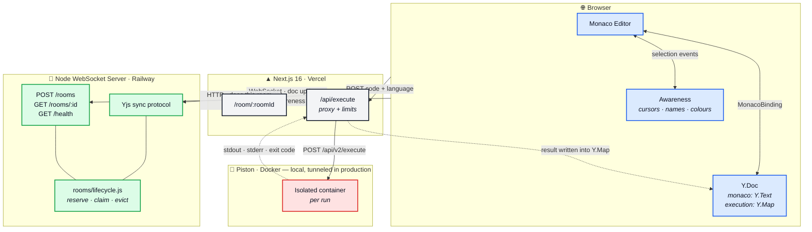
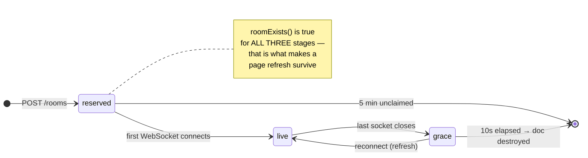
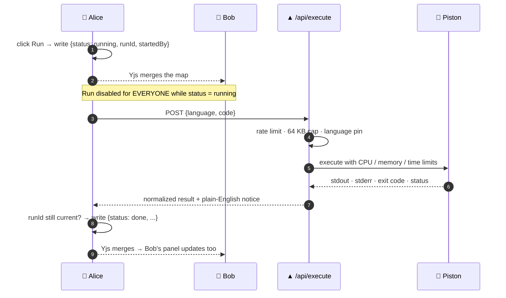

<div align="center">

# ⚡ CollabCode

### Real-time collaborative code editor with sandboxed execution

**Open a room. Share the link. Type together. Run the code — everyone sees the output.**

No accounts. No database. No `eval()`.

<br/>

[](https://nextjs.org/)
[](https://react.dev/)
[](https://www.typescriptlang.org/)
[](https://tailwindcss.com/)

[](https://yjs.dev/)
[](https://nodejs.org/)
[](https://github.com/websockets/ws)
[](https://github.com/engineer-man/piston)

<br/>

[](https://real-time-collabrative-code-editor-two.vercel.app)
[](https://collabrativecodeeditor-production.up.railway.app)


<br/>

**[🌐 Live Demo](https://real-time-collabrative-code-editor-two.vercel.app)** · [Features](#-features) · [Architecture](#-architecture) · [How it works](#-how-it-works) · [Quick start](#-quick-start)

</div>

<!-- ─────────────────────────────────────────────────────────────
     📸 SCREENSHOT SLOT — hero
     Drop the image at docs/screenshots/hero.png, then uncomment:

<div align="center">
  
</div>

     See the "Screenshots to capture" checklist further down.
────────────────────────────────────────────────────────────── -->

---

## 🎯 What this is

Pair programming, technical interviews, and classroom coding usually happen over a screen-share
with **no shared, executable environment**. One person types; everyone else watches.

CollabCode fixes that with a room you can share by URL:

| | |
| :-- | :-- |
| 👥 | **Everyone types at once.** Concurrent edits merge without conflicts — CRDTs, not locks or turn-taking. |
| 🎨 | **You can see where everyone is.** Live cursors, live selections, coloured name labels. |
| ▶️ | **Anyone can hit Run.** The result appears in *everyone's* output panel, not just the clicker's. |
| 🔒 | **Untrusted code runs in a real sandbox.** Isolated containers with CPU, memory, and output ceilings — never `eval()` in the browser. |
| 💨 | **Nothing is stored.** No accounts, no database. The room dies when the last person leaves. |

> **The two hard problems this project is actually about:** keeping edit state consistent across
> concurrent users without merge conflicts, and running arbitrary untrusted code without
> compromising the host. Most tutorial projects skip both — they fake sync with "last write wins"
> and fake execution with `eval()`.

---

## 🌐 Live demo

| Service | Status | URL |
| :-- | :-- | :-- |
| **Frontend** | 🟢 Live | [real-time-collabrative-code-editor-two.vercel.app](https://real-time-collabrative-code-editor-two.vercel.app) |
| **Sync server** | 🟢 Live | `wss://collabrativecodeeditor-production.up.railway.app` |
| **Piston sandbox** | 🟡 Tunneled | a local container, reached over a fixed tunnel hostname |

> [!IMPORTANT]
> **Execution on the live demo runs on a developer machine, not in the cloud.**
> Piston needs a privileged Docker container with `tmpfs … :exec` to build its isolation layer,
> and neither Vercel nor Railway permits that. So the deployed `/api/execute` points at a local
> Piston exposed through a reserved ngrok hostname (`PISTON_API_URL`).
>
> The consequence is honest and unavoidable: **Run works on the live demo only while that
> machine is online.** When it isn't, Run reports *"Could not reach the code execution service."*
> Making this independent of any one machine means [hosting Piston on a VPS](#️-roadmap).
>
> **[Running locally](#-quick-start) is the reliable way to see it** — three commands, no tunnel.

---

## ✨ Features

<table>
<tr><th align="left" width="220">Feature</th><th align="left">What it does</th></tr>

<tr><td>🔗 <b>Room links</b></td><td>Create a room or paste a link to join. Room IDs are <code>crypto.randomUUID()</code> — unguessable, and <b>minted by the server</b>, so an ID nobody was ever issued is refused at connect time.</td></tr>

<tr><td>👤 <b>Identity, no accounts</b></td><td>First name, last name, random palette colour. Stored per-tab in <code>sessionStorage</code>.</td></tr>

<tr><td>⌨️ <b>Conflict-free editing</b></td><td>Monaco bound to a Yjs <code>Y.Text</code>. Two people typing on the same line converge to the same result — verified with simultaneous typers.</td></tr>

<tr><td>🖱️ <b>Live cursors &amp; selections</b></td><td>Every peer's caret and selection rendered in their colour with a name label, via Yjs's awareness protocol.</td></tr>

<tr><td>🟢 <b>Presence bar</b></td><td>Who's in the room right now. Duplicate names get numbered (<code>Naman S1</code> / <code>Naman S2</code>); duplicate colours get reassigned — resolved identically on every client.</td></tr>

<tr><td>🔔 <b>Join / leave toasts</b></td><td>Subtle banner + sound effect when someone arrives or leaves.</td></tr>

<tr><td>▶️ <b>Shared execution</b></td><td>Run streams stdout / stderr / exit code to <b>everyone in the room</b>, captioned with who ran it and in which language.</td></tr>

<tr><td>🌍 <b>5 languages</b></td><td>JavaScript · Python · TypeScript · Java · C++ — one dropdown drives syntax highlighting, the sandbox runtime, and the download extension.</td></tr>

<tr><td>💾 <b>Save to device</b></td><td>Downloads the current buffer with the right extension (<code>main.py</code>, <code>main.cpp</code>, <code>Main.java</code>…). Purely local — nothing touches the server.</td></tr>

<tr><td>♻️ <b>Room lifecycle</b></td><td>Rooms self-destruct 10s after the last person leaves. A refresh survives; a closed room shows "This room has closed" and sends you home.</td></tr>

<tr><td>🛡️ <b>Abuse limits</b></td><td>10 req/min/IP on room creation and execution, 64 KB code cap, plus hard CPU / memory / wall-clock ceilings inside the sandbox.</td></tr>

</table>

---

## 🏗️ Architecture

Three independent processes. **Editing sync and code execution never touch each other.**



### Why sync and execution are separate systems

> Editing sync must be **low-latency and always-on** — every keystroke matters.
> Execution is **bursty, resource-heavy, and handles untrusted input**.
>
> Couple them, and one slow or crashed execution request degrades live editing for the whole
> room. Keeping them apart lets each scale, fail, and recover independently.

The same split exists *inside* the WebSocket connection — two protocols, one socket:

| | **Document updates** | **Awareness** |
| :-- | :-- | :-- |
| Contents | CRDT edit operations | Cursor, selection, name, colour |
| Durability | Durable — merged and replayed across reconnects | Ephemeral — dropped entirely on disconnect |
| Rule | ⛔ **Cursor positions must never enter document history.** | |

---

## 🧠 How it works

Each section below is a self-contained deep dive. **Click to expand.**

<details>
<summary><b>🔀 CRDT sync — why Yjs, and why not Operational Transform</b></summary>

<br/>

Concurrent editing needs an answer to: *two people typed on the same line at the same moment —
what does the file say now?*

**Operational Transform** (Google Docs) answers it by transforming each operation against every
concurrent one, in a defined order, on a **central authority**. It's correct, it's compact, and
it's notoriously hard to implement — the transform functions have to satisfy convergence
properties that are easy to get subtly wrong.

**CRDTs** (Yjs) answer it by giving every character a globally unique, totally-ordered identity.
Merge becomes commutative and idempotent: apply the same set of ops in any order and every client
lands on the same document, **with no server arbitration at all**.

| | CRDT (chosen) | Operational Transform |
| :-- | :-- | :-- |
| Server role | Dumb relay — just broadcasts bytes | Authority — must transform and order |
| Reconnect / offline | Falls out for free | Needs explicit catch-up logic |
| Implementation risk | Library-provided, battle-tested | Easy to get subtly, silently wrong |
| Cost | Per-character metadata overhead | Smaller payloads |

For this project the tradeoff is one-sided: the metadata overhead is invisible at editor scale,
and the payoff is a sync server that needs **zero** knowledge of text editing. `server/src/sync/connection.js`
relays opaque binary frames; it has no idea what a character is.

**Where it lives:** `web/src/components/editor/CodeEditor.tsx` — the `Y.Doc`, provider,
awareness handler, and `MonacoBinding` are all created and destroyed inside one effect keyed on
the room and the local user.

</details>

<details>
<summary><b>🎨 Presence — and why remote awareness state is treated as hostile input</b></summary>

<br/>

Every client publishes `{ name, color }` plus its cursor/selection through Yjs's awareness
protocol. Peers render it as coloured carets, name labels, and presence chips.

**The catch:** a peer sets its own `user` field to *whatever it likes*. That value never passes
through our form, so sanitizing at the input boundary proves nothing.

`web/src/lib/collab/awareness.ts` → **`readPeers()`** is the single boundary where raw awareness state
becomes values the UI may render:

- 🧼 **Names are re-sanitized.** React escapes HTML, but an unbounded or control-character name
  still wrecks the layout.
- 🎨 **Colours must match `/^#[0-9a-f]{6}$/i`**, else they fall back to grey.

> ⚠️ **This was verified exploitable before the guard existed.** A peer broadcasting the colour
> `red } body { display: none } .x {` reached an inline `style` / the cursor `<style>` block and
> **blanked out every other participant's page.**

The presence bar *and* the remote-cursor stylesheet both consume `readPeers()`'s output.
Neither is allowed to read `awareness.getStates()` directly — and neither is anything added later.

**`readPeers()` also resolves collisions**, because they can't be prevented earlier:

| Collision | Why it can't be prevented | How it's resolved |
| :-- | :-- | :-- |
| Two "Naman Singla" → both `Naman S.` | The name dialog has no room context — the Yjs stack doesn't exist until identity is submitted | Numbered: `Naman S1` / `Naman S2` |
| Two peers pick the same palette colour | 8 colours, chosen at random per joiner, zero coordination | Later peer swaps to the first free entry |

Resolution walks peers in ascending `clientID` — the one ordering **every client agrees on** — so
all viewers independently compute the same winner. Your stored colour is never modified; only the
rendered copy shifts, and only while the collision lasts.

</details>

<details>
<summary><b>♻️ Room lifetime — three stages, one authority</b></summary>

<br/>



**`server/src/rooms/lifecycle.js` is the only module that knows about any of this**, and the only thing that
ever deletes a room.

**Why it has to exist:** y-websocket's `closeConn` puts `docs.delete(doc.name)` *inside* an
`if (persistence !== null)` branch — and this server deliberately never calls `setPersistence`.
Left alone, the `docs` map **only ever grows**: a "closed" room keeps holding its old code, and
memory is unbounded. `scheduleEviction()` owns that deletion instead, and re-checks
`conns.size === 0` **when the timer fires** rather than trusting the cancel path — a reconnect
landing mid-grace must not lose its document to an already-queued timer.

**Why the gate must be server-side:** `setupWSConnection` calls `map.setIfUndefined(docs, docName, …)`,
so *connecting to a room is what creates it*. A client-side check alone would be bypassed the
instant the socket opened, and the "dead" room would spring back into existence, empty.
`server/src/sync/connection.js` refuses unknown rooms **before** calling `setupWSConnection` — which is
also what stops an old tab, reconnecting after an eviction or a server restart, from silently
resurrecting the room it remembers.

**Why refusal is a close code, not a rejected upgrade:** a rejected upgrade reaches the browser as
an opaque error with no code attached. The client has to distinguish *"this room is gone"* (stop
retrying, show the closed screen) from *"the network blipped"* (keep retrying). So the server
accepts the handshake and immediately closes with **`4404` / `CLOSE_ROOM_NOT_FOUND`**.

> y-websocket reconnects forever on its own, so the client's handler must call
> `provider.disconnect()` — setting `shouldConnect = false` is the only thing that stops the redial.

**`missing` and `unreachable` are separate states, permanently.** `RoomGate` redirects home only
for `missing`; an unreachable sync server gets its own screen with a **Retry**, because the room
may be perfectly alive and merely unverifiable. Collapsing the two would tell people their room
was gone every time the network hiccuped.

`RoomGate` also **must not mount the editor while checking** — mounting is what opens the socket,
which is exactly what the gate exists to prevent.

</details>

<details>
<summary><b>▶️ Shared execution — how Run reaches everyone without a new server message</b></summary>

<br/>

Clicking **Run** broadcasts the result to the whole room. This rides **entirely on Yjs** — the
sync server needed *zero* changes.

The trick: put a second shared type on the **same `Y.Doc`** that already holds the code.

```
yDoc.getText("monaco")            ← the code
yDoc.getMap("execution")          ← the shared run result
```

y-websocket's sync protocol doesn't distinguish between shared types — it merges the whole
document — so the execution map reaches every peer, **including late joiners**, for free.



**One key, whole-record replacement.** The map has a single key, `"state"`, whose value is the
*entire* result object — never separate sub-fields. That makes each write atomic from Yjs's
perspective: two concurrent writes resolve to one complete record, never a Frankenstein mix of
fields from two different runs.

**`runId` resolves the one race the room-wide lock can't.** Run is disabled for every peer while
status is `running` — but two peers can both click *before* either has received the other's write.
Both converge on one winning record; the **loser's** Piston response, arriving later, must notice
`executionMap.get("state")?.runId !== runId` and discard itself rather than clobber the winner.

**A dead runner must not lock the room forever.** 🐛 *Found while testing this feature:* if the
person who clicked Run closes their tab before the fetch resolves, the browser cancels it outright.
Nothing ever writes a final result — and since every peer's Run button stays disabled while status
is `running`, the room would sit on **"Running…" permanently**, with no way for anyone to recover it.

Fixed with a watchdog: every connected client runs an interval that checks whether the current
`running` record is older than `STALE_RUN_MS` and, if so, writes an error record itself. There is
no "owner" of an abandoned run once it's shared state — whichever client's tick fires first heals
it for everyone, and the rest are idempotent no-ops.

**The output panel shows the run's own language, never your local dropdown.** The selector is a
per-user editing preference; two peers can be on different languages while watching the same run.
The caption ("Run by Alice A. · Python") always reflects what actually executed.

</details>

<details>
<summary><b>⏱️ Three nested timeouts — and why the ordering is the whole point</b></summary>

<br/>

```
        ┌──────────────────────────────────────────────────┐
        │  STALE_RUN_MS = 25s      client watchdog          │
        │  ┌────────────────────────────────────────────┐  │
        │  │  PISTON_TIMEOUT_MS = 18s   fetch abort      │  │
        │  │  ┌──────────────────────────────────────┐  │  │
        │  │  │  10s compile + 5s run = 15s worst    │  │  │
        │  │  │  sandbox stops the PROGRAM           │  │  │
        │  │  └──────────────────────────────────────┘  │  │
        │  └────────────────────────────────────────────┘  │
        └──────────────────────────────────────────────────┘
```

| Layer | Value | Catches |
| :-- | :-- | :-- |
| 🔴 Sandbox | 10s compile + 5s run | A runaway **program** |
| 🟠 Route `AbortController` | 18s | A **Piston** that never answers at all |
| 🟡 Client watchdog | 25s | A **client** that vanished mid-run |

**Each layer must sit above the one it contains**, or it starts firing on cases the inner layer
was about to handle correctly:

- Set the fetch abort to 15s → a legitimate 10s-compile-plus-5s-run reports *"Execution timed out"*.
- Set the watchdog below the fetch abort → a merely-slow run is reported room-wide as a lost connection.

> **Change one and re-check all three.**

</details>

<details>
<summary><b>🛡️ Sandbox limits — what a single run may consume</b></summary>

<br/>

Sent with every Piston request from `app/api/execute/route.ts`, and mirrored as ceilings in
`docker-compose.yml`.

| Limit | Value | Why this number |
| :-- | :-- | :-- |
| `run_timeout` / `run_cpu_time` | **5s each** | Wall and CPU are **separate** ceilings and both must be raised together. `while True: pass` burns CPU as fast as wall clock — verified: with only `run_timeout: 5000` set, it still died at 3.1s on the default `run_cpu_time`. |
| `compile_timeout` / `compile_cpu_time` | **10s each** | Piston's own defaults; `javac` and `g++` need the room. |
| `run_memory_limit` | **256 MB** | An allocation loop is stopped here rather than by the host running out of memory. |
| `compile_memory_limit` | **512 MB** | Verified sufficient for the Java and C++ packages; the run stage is the one worth squeezing. |
| `PISTON_OUTPUT_MAX_SIZE` | **64 KB** | Default is **1 KB** — see the gotcha below. |

Piston's untouched defaults do real work too: **`max_process_count` (64)** is what bounds a fork
bomb, and **`max_open_files` (2048)** a descriptor-exhaustion loop.

> [!WARNING]
> **Piston 400s the entire request if any per-request limit exceeds its configured ceiling**
> (`run_timeout cannot exceed the configured limit of 3000`). The numbers in `route.ts` and the
> `PISTON_*` vars in `docker-compose.yml` are **one setting in two places** — never raise the
> route's without raising compose's first. Those vars live *only* in compose, so a Piston started
> any other way silently reverts to the **tighter** defaults, and every run fails outright.

**A sandbox-killed program must not read as a crash in the user's code.**

| What Piston returns | What the user sees |
| :-- | :-- |
| `status: "OL"`, `SIGABRT`, stderr `Sandbox keeper received fatal signal 6` | 🟡 *"Output limit reached — the program printed too much and was stopped."* |
| `code: 137`, stderr `/piston/packages/python/3.10.0/run: line 3: 3 Killed …` | 🟡 *"The program was stopped — it most likely exceeded the 256 MB memory limit."* |
| `status: "TO"` | 🟡 *"The program ran longer than 5s and was stopped by the sandbox."* |
| `status: "RE"`, `code: 1` (a normal `raise ValueError`) | Nothing extra — stderr and the exit code already say it. |

The raw sandbox-internals lines are stripped from stderr; the amber notice replaces them.
`"RE"` deliberately earns **no** banner unless `code === 137`, since it means *any* non-zero exit
and an "Exited with error status 1" over the top of a real traceback is pure noise.

</details>

<details>
<summary><b>🚦 Rate limiting &amp; payload caps — including what they honestly don't do</b></summary>

<br/>

Both endpoints that cost real resources are limited to **10 requests / minute / IP**:

| Endpoint | Where | Accuracy |
| :-- | :-- | :-- |
| `POST /rooms` | Sync server | ✅ **Exact** — one Railway process, one counter |
| `POST /api/execute` | Frontend | ⚠️ **Approximate** — see below |

> **The frontend limiter is honestly approximate, and the code says so.**
> No Redis and no database is a deliberate v1 constraint, so there is no shared counter. On Vercel,
> each serverless instance keeps its own — a caller spread across N warm instances gets up to N×
> the nominal limit. **It converts an unbounded flood into a bounded one. It is not a security
> boundary.**

**This is a different thing from `MAX_RESERVATIONS`.** That's a global ceiling (1000) on unclaimed
rooms with no notion of *who* created them; the limiter bounds a *single caller*. Both are needed —
the limiter stops one script exhausting the ceiling, the ceiling stops many callers doing it.

**A 429 must never be reported as "couldn't reach the sync server."** Rate limiting makes
*"the server answered and refused"* a state a normal user can hit, and the two call for opposite
reactions (**wait** vs **retry now**). `createRoom()` throws a `RoomCreateError` carrying the
server's own wording; only a genuinely unanswered request falls back to the reachability message.

**`MAX_CODE_BYTES` (64 KB) is checked twice, deliberately:**

1. **Cheap:** `Content-Length` before the body is read, so an absurd payload is refused without
   being buffered. Deliberately **loose** (`64 KB × 2 + 4 KB`) — that header measures the JSON
   envelope, and escaping can nearly double a program made of quotes and newlines.
2. **Exact:** on the decoded `code` string afterwards. This is the one that enforces the cap.

Both use **UTF-8 byte length**, never `String.length` — a document of emoji or CJK is up to 4× its
character count on the wire, and the wire size is what's being capped. The client checks the same
shared constant before fetching: a courtesy, not the enforcement (the route is reachable without
the UI), but it means an oversized document never crosses the wire.

</details>

<details>
<summary><b>💾 Save — the mirror image of Run</b></summary>

<br/>

Save is **entirely local**, on purpose. It builds a `Blob` from the editor's current text, clicks a
throwaway `<a download>`, and revokes the object URL. No Yjs write, no request, nothing stored
anywhere — *"saving a file means downloading it to the user's device."*

**It must stay off the shared `Y.Doc`.** The language dropdown is a per-user preference, so two
peers looking at identical text can be on different languages and each has to get their own
extension — verified with two tabs: one on C++ downloaded `main.cpp` while the other downloaded
`Main.java`, same contents. Putting the filename into shared state would force one peer's choice
onto everyone.

**Java is the one capitalized filename** — `Main.java`, not `main.java`, because `javac` requires a
public class to live in a file named after it. Every other language gets `main.<ext>`.

Save's only disabled state is an empty document. Unlike Run, there is no room-wide lock — there's
nothing for two clickers to contend over.

</details>

<details>
<summary><b>🪟 Why BroadcastChannel is disabled, and must stay disabled</b></summary>

<br/>

The provider is constructed with `{ disableBc: true }`.

By default, y-websocket also syncs same-origin tabs peer-to-peer over a `BroadcastChannel`. That
**breaks presence**: when a tab closes, the server broadcasts the awareness removal — and a sibling
tab immediately **re-announces the departed client** with a higher clock. The peer is resurrected
within milliseconds and never ages out, because each re-announce refreshes its `lastUpdated`, so
the 30s `outdatedTimeout` never fires.

**Verified:** with BC on, closing a tab left the user in the presence bar *indefinitely* (still
there after 10s). With BC off it disappears in under 2s.

The trap: departures looked perfectly fine across two separate browser *contexts* — which is
exactly the case BroadcastChannel doesn't cover. **Testing in one browser is what catches this**,
and one browser is also the documented way to test multiplayer locally.

Turning BC off costs nothing here: every real collaborator is a different browser and syncs through
the server anyway.

</details>

---

## 🚀 Quick start

> **Prerequisites:** Node.js 22+, Docker (with Compose), and ~2 GB free for Piston's language images.

**Three processes.** There is **no root `package.json`** — the two workspaces install separately.

```bash
git clone <repo-url>
cd Real-Time-Collabrative-Code-Editor-with-Sandbox-Execution-
```

<table>
<tr><td width="33%" valign="top">

**1️⃣ Piston sandbox**

```bash
cd web
docker compose up -d
```

🐳 → `localhost:2000`

</td><td width="33%" valign="top">

**2️⃣ Sync server**

```bash
cd server
npm install
cp .env.example .env
npm run dev
```

🔌 → `localhost:8080`

</td><td width="33%" valign="top">

**3️⃣ Frontend**

```bash
cd web
npm install
npm run dev
```

▲ → `localhost:3000`

</td></tr>
</table>

Open **<http://localhost:3000>**, click **Create a Room**, enter a name, and you're in.

### 🧪 Testing multiplayer locally

Open the room URL in a **second tab of the same browser**. Identity lives in `sessionStorage`, which
is per-tab — so tab 2 is a genuinely separate collaborator with its own cursor and colour.

> 💡 This is also the *only* configuration that catches the BroadcastChannel presence bug described
> above. Two separate browser profiles will happily hide it.

<details>
<summary><b>🩺 Troubleshooting</b></summary>

<br/>

**"Piston looks down but the container is running."** The container may live on the `default` Docker
context while `desktop-linux` is current — `docker ps` then looks empty even though Piston is serving
fine. Check `docker context ls`, and confirm with:

```bash
curl -s localhost:2000/api/v2/runtimes | head -c 200
```

**"Unsupported language" or every run fails.** `LANGUAGE_MAP` in `app/api/execute/route.ts` pins exact
runtime versions (`python@3.10.0`, `java@15.0.2`, …). They must match what `/api/v2/runtimes` reports —
re-check that endpoint after any Piston image update.

**Every run 400s with "cannot exceed the configured limit."** Piston was started without the
`PISTON_*` env vars from `docker-compose.yml`, so it reverted to its tighter defaults. Start it via
`docker compose up -d`, not `docker run`.

**Everyone gets sent home at once.** The sync server restarted. Documents are in-memory only, so a
restart wipes the room registry, and every client's reconnect is correctly refused.

**On the deployed site: *"Code execution service returned an invalid response."*** The tunnel is
down, so the route received the tunnel provider's HTML error page where it expected Piston's JSON.
Check `systemctl --user status ngrok-piston` on the host machine — **not** the Vercel logs.

**On the deployed site: *"Couldn't reach the sync server."*** Before blaming Railway, check whether
your own DNS resolves it — some mobile-carrier resolvers refuse the whole `up.railway.app` zone
while resolving `railway.app` fine, which is indistinguishable from a dead server in the browser.
See [`server/README.md`](server/README.md#troubleshooting-couldnt-reach-the-sync-server) for the
one-line `curl --resolve` check that settles it.

</details>

---

## ⚙️ Environment variables

<table>
<tr><th align="left">Variable</th><th align="left">Where</th><th align="left">Default</th><th align="left">Purpose</th></tr>

<tr><td><code>NEXT_PUBLIC_WS_URL</code></td><td><code>web/.env.local</code></td><td><code>ws://localhost:8080</code></td><td>Sync server URL. <b>Also the source of the room-routes HTTP base</b> — <code>web/src/lib/collab/rooms.ts</code> just swaps the scheme, so there's no second variable that could drift.</td></tr>

<tr><td><code>PISTON_API_URL</code></td><td><code>web</code></td><td><code>http://localhost:2000</code></td><td>Piston base URL. <b>No trailing slash</b> — the route appends <code>/api/v2/execute</code> itself. In production this is the tunnel hostname; a Vercel env change only reaches a <i>new</i> deployment, so it needs a redeploy to take effect.</td></tr>

<tr><td><code>PORT</code></td><td><code>server/.env</code></td><td><code>8080</code></td><td>Serves both the WebSocket upgrade and the room HTTP routes — one listener, one port.</td></tr>

<tr><td><code>ROOM_GRACE_MS</code></td><td><code>server/.env</code></td><td><code>10000</code></td><td>How long an emptied room lingers before destruction.</td></tr>

<tr><td><code>ROOM_RESERVATION_MS</code></td><td><code>server/.env</code></td><td><code>300000</code></td><td>How long a created-but-never-entered room stays claimable.</td></tr>

<tr><td><code>PISTON_*</code> (7 vars)</td><td><code>docker-compose.yml</code></td><td>see file</td><td><b>Ceilings inside the container, not app config.</b> Piston rejects any per-request limit above them.</td></tr>

<tr><td><code>DATABASE_URL</code></td><td><code>web/.env.local</code> and <code>server/.env</code></td><td>—</td><td>Neon's <b>pooled</b> connection string (host contains <code>-pooler</code>), used at runtime by both workspaces. <b>Optional in <code>server/</code></b> — unset, no pool is opened and the dead-room snapshot is a no-op, so the sync server runs exactly as it did in v1.</td></tr>

<tr><td><code>DIRECT_URL</code></td><td><code>web/.env.local</code></td><td>—</td><td>Neon's <b>unpooled</b> string, used by <code>prisma migrate</code> alone. <b>Not interchangeable with <code>DATABASE_URL</code></b>: the pooler can't hold the session-level lock a migration takes, so migrations aimed at it hang or half-apply.</td></tr>

</table>

---

## 📁 Repo layout

```
.
├── web/              ▲ Next.js 16 frontend (Vercel)
│   ├── app/
│   │   ├── page.tsx                 landing — create / join a room
│   │   ├── room/[roomId]/page.tsx   the room route; roomId IS the Yjs doc name
│   │   ├── api/execute/route.ts     Piston proxy · rate limit · size cap · sandbox limits
│   │   ├── components/
│   │   │   ├── CodeEditor.tsx       ⭐ the whole client Yjs stack + Run/Save
│   │   │   ├── RoomGate.tsx         decides if a room may be entered — BEFORE any socket opens
│   │   │   ├── UserBar.tsx          presence chips
│   │   │   ├── IdentityDialog.tsx   name + colour prompt
│   │   │   └── ActivityToasts.tsx   join / leave banners
│   │   └── lib/
│   │       ├── awareness.ts         🛡️ readPeers() — the untrusted-input boundary
│   │       ├── user.ts              identity as an external store
│   │       ├── rooms.ts             WS_URL, createRoom(), checkRoom()
│   │       ├── languages.ts         the ONE language enumeration
│   │       ├── execution.ts         MAX_CODE_BYTES, shared by client and route
│   │       ├── db.ts                the ONE place the app learns about Postgres
│   │       └── rateLimit.ts         sliding window (copy #1)
│   ├── prisma/schema.prisma         ⭐ the authority on the dead_rooms table
│   ├── prisma.config.ts             Prisma CLI config — migrations use DIRECT_URL
│   └── docker-compose.yml           🐳 Piston + its ceilings
│
└── server/                          🔌 Node WebSocket server (Railway)
    ├── index.js                     one listener: HTTP routes + WS upgrade
    ├── sync/connection.js             the only place that speaks the Yjs wire protocol
    ├── rooms/lifecycle.js                     ⭐ the one authority on whether a room exists
    ├── db.js                        one pg pool + one INSERT — no ORM, on purpose
    └── rateLimit.js                 sliding window (copy #2)
```

> **`rateLimit` and the `4404` close code exist twice on purpose.** The two workspaces share no
> build and no code — a shared package would be the only alternative, and it isn't worth it for
> forty lines.

---

## 🗺️ Roadmap

**v1 is feature-complete.** Every box in [`V1_Tasks.md`](V1_Tasks.md) is ticked.

<table>
<tr><th align="left">Deliberately out of scope for v1</th><th align="left">Why</th></tr>
<tr><td>🚫 Database / persistence</td><td>Rooms are meant to be ephemeral. Documents are <b>in-memory only</b> — room state does not survive a sync-server restart.</td></tr>
<tr><td>🚫 Redis pub/sub</td><td>Horizontal scaling isn't needed at this size. <b>The one thing its absence genuinely costs:</b> the frontend's rate limiter counts per serverless instance instead of globally.</td></tr>
<tr><td>🚫 Accounts / auth</td><td>The room link <i>is</i> the credential.</td></tr>
</table>

**Beyond v1:**

- [ ] 🐳 Host Piston on a VPS that allows privileged containers, so **Run** on the live demo stops
      depending on a developer machine being online (the image is **amd64-only**, so ARM free tiers
      are out)
- [ ] 🗄️ Postgres persistence — **in progress (v2).** The `dead_rooms` table and both
      connections exist; the snapshot write on room death and the `/profile` page do not yet.
      Note this never makes a *live* room survive a restart: a snapshot is read-only and is
      written when a room dies normally.
- [ ] 🔴 Redis pub/sub — multiple sync instances sharing room state, and a global rate limiter
- [ ] 🔗 Shareable short links

---

<details>
<summary><b>📸 Screenshots to capture</b> — placeholder slots are marked in the source of this file</summary>

<br/>

Drop images in `docs/screenshots/`, then uncomment the matching block in `README.md`.

| File | What to capture |
| :-- | :-- |
| `hero.png` | Two browser tabs side by side, same room, **both cursors visible with name labels**, mid-edit. The single most valuable image — it proves the whole premise in one glance. |
| `presence.png` | Close crop of the top user bar with 3+ users in distinct colours. Bonus if it shows a numbered duplicate (`Naman S1` / `Naman S2`). |
| `run.png` | The output panel after a successful run, showing the *"Run by … · Python"* caption. |
| `notice.png` | An amber sandbox notice — easiest to trigger with `while True: print("x" * 1000)` (output cap) or an allocation loop (memory cap). |
| `closed-room.png` | The "This room has closed" screen. Visit `/room/does-not-exist`. |
| `landing.png` | The create/join landing page. |

**Tip:** capture at a 1440px-wide window; GitHub renders README images at ~900px, so anything
narrower looks soft.

</details>

---

## 📄 License

MIT.

<div align="center">
<br/>

**Built to explore two genuinely hard problems: distributed state convergence and execution isolation.**

<sub>If you found this interesting, a ⭐ is appreciated.</sub>

</div>
