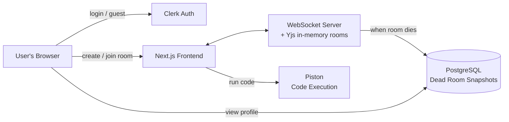
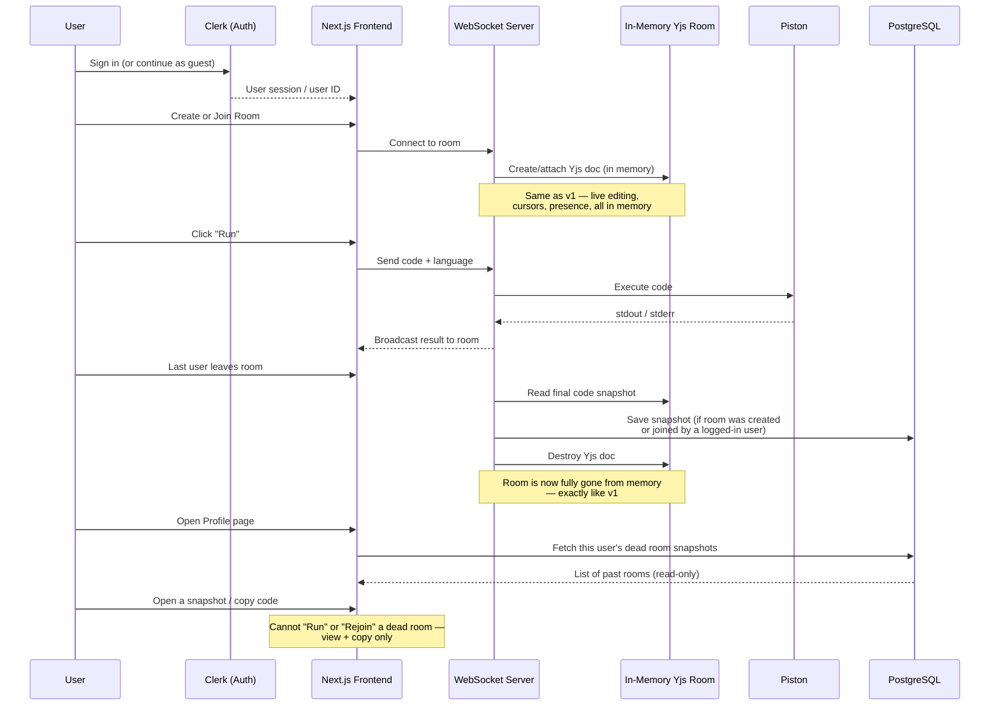

# CollabCode — Version 2 Build Checklist

> This file is written for **Claude Code**. It explains what already exists (v1), what needs to be added (v2), and shows the architecture in simple diagrams so anyone — recruiter, reviewer, or developer — can understand it quickly.

---

## 1. What v1 already does

- No accounts. Anyone can create or join a room.
- Rooms live only in server memory (Node.js + Yjs).
- Code runs through Piston.
- File is saved by downloading it — nothing stored server-side.
- Room and all its data disappear the moment everyone leaves.

**v1 has zero persistence. That is the main thing v2 changes.**

---

## 2. What v2 adds (in plain words)

1. **Login with Clerk.** Users can sign in with a real account, or continue as a guest like before.
2. **A PostgreSQL database.** Only Postgres — no Redis, no other data stores.
3. **"Dead rooms."** When everyone leaves a room, the room's final code is saved to the database and linked to the signed-in user who created it (or was in it). The live room is destroyed exactly like in v1 — but a **read-only snapshot** now survives in the user's profile.
4. **A profile page** where a logged-in user can see all their past rooms, open a snapshot, and copy the code — but **cannot** run it or rejoin it as a live room. It's dead: viewable and copyable only.
5. Guests (not logged in) behave exactly like in v1 — no history, nothing saved for them.

---

## 3. Tech stack for v2

| Layer | v1 | v2 (new/changed) |
|---|---|---|
| Frontend | Next.js | Next.js (unchanged) |
| Auth | None | **Clerk** (full auth + guest mode) |
| Real-time sync | Yjs (in-memory) | Yjs (in-memory) — unchanged |
| Backend | Node.js + WebSocket | Node.js + WebSocket — unchanged |
| Code execution | Piston (Docker) | Piston (Docker) — unchanged |
| Database | None | **PostgreSQL** (new) |
| ORM | — | Prisma or Drizzle (pick one) |
| Hosting | Vercel + Railway | Vercel + Railway (DB on Railway/Neon/Supabase) |
| File download | Single file | **JSZip** (client-side) for multi-file "Save as .zip" |

**No Redis. No other databases. Postgres only.**

---

## 4. Simple architecture diagram (high level)



**In one sentence:** live rooms still work exactly like v1 in memory, but the moment a room dies, its final snapshot is written once to Postgres so a logged-in user can find it later in their profile.

---

## 5. Detailed architecture diagram (with data flow)



---

## 6. Database schema (Postgres)

Keep it minimal — two tables: the snapshot itself, and who may read it.

```
dead_rooms
├── id              (uuid, primary key)
├── room_id         (text, UNIQUE — the original ephemeral room ID)
├── files           (jsonb — array of { filename, content }, supports multi-file rooms)
├── language        (text, NULLABLE — the room's single language, see Section 10.1)
├── is_private      (boolean — was this room password-protected)
├── participants    (jsonb — names/colors of everyone who was in the room, optional)
├── created_at      (timestamptz — when the room was first created)
└── died_at         (timestamptz — when the last person left)

dead_room_members            -- who can see this snapshot on /profile
├── dead_room_id    (uuid, FK -> dead_rooms.id, ON DELETE CASCADE)
├── user_id         (text — a *verified* Clerk user ID, never a self-reported one)
└── PRIMARY KEY (user_id, dead_room_id)
```

> Note: `code` (single string) from earlier drafts is replaced by `files` (an array) so multi-file rooms save cleanly. A single-file room is just a `files` array with one entry.

> **`owner_user_id` and its `(owner_user_id, died_at DESC)` index are gone**, replaced by
> `dead_room_members`. See Section 6.1 for why. 7.2 already migrated the old shape, so this
> costs a **second migration** that drops the column and the index and creates the new table —
> cheap now, painful once `/profile` reads the old shape.

> The `/profile` listing is `dead_room_members` joined to `dead_rooms`, ordered by `died_at`.
> The composite primary key `(user_id, dead_room_id)` is the index that serves it — `user_id`
> leading, so one user's rows are contiguous. Sorting happens after the join, which is fine at
> v2's scale; if it ever isn't, copy `died_at` onto the member row and index
> `(user_id, died_at DESC)`.

---

### 6.1 Who a dead room belongs to

**The rule, in one line: every signed-in person who really took part gets to keep a copy;
guests keep nothing; the room itself still dies exactly like v1.**

Longer, as four rules:

1. **One snapshot per room, written once**, at the moment the room is destroyed (last socket
   closed, grace window elapsed, nobody reconnected). Never updated afterwards.
2. **A snapshot is written only if at least one participant was a verified Clerk user.** All
   guests → nothing is written at all, exactly like v1.
3. **Every verified signed-in participant who met the contribution threshold gets a
   `dead_room_members` row**, and therefore sees the room on their `/profile`. Not just the
   creator, and not just whoever left last.
4. **"Verified" means a Clerk token the *server* checked.** Never awareness state and never a
   client-supplied ID — see CLAUDE.md, "Accounts (Clerk)": a forged ID would write a
   stranger's code into someone else's profile.

**Why not "the creator owns it"** (the original draft of this section):

- The creator is frequently a guest who made the room and shared the link, which leaves the
  row with no owner at all and forces a fallback rule anyway.
- Ownership is wrong exactly when it matters most: A creates a room, leaves after two minutes,
  B works in it for an hour. A gets the snapshot; B — the person who wrote the code and will
  go looking for it — gets nothing.
- There is no such thing as an owner in `server/rooms.js` today; it records nothing about a
  room but timers. Inventing one, plus a transfer rule for when the owner leaves, is real
  complexity for behaviour no user can see or predict.

**Why not "whoever left last owns it":** it makes keeping your own work depend on tab-close
order. Close your laptop first and an hour of work silently goes to somebody else.

Membership costs nothing extra to compute: 7.3 has to verify a Clerk token per connection
regardless, which yields a *set* of signed-in users per room. Collapsing that set to one person
is the thing that would take extra work, not keeping it.

**The contribution threshold, and the trade it exists to blunt.** Under this rule, a signed-in
stranger who clicks a shared link, lurks for thirty seconds and leaves keeps a permanent
private copy of the code. So a participant earns a `dead_room_members` row only if they were
connected **while the document was non-empty** and for **more than a trivial moment** (the
server already tracks connection times for the grace timer; a threshold on the order of the
grace window is the natural choice). Section 10.3's room passwords carry the rest of the
weight: a password-protected room is the "this is not public" signal, so an unprotected room
being copyable by the people who worked in it is the expected behaviour.

**Deleting.** Because several accounts can hold one snapshot, "delete this from my profile"
means deleting that user's `dead_room_members` row, not the `dead_rooms` row. (Not a v2
checklist item; recorded so it isn't designed wrong later.)

#### Every scenario, in a table

A creates the room, B joins later.

| Situation | What happens |
| --- | --- |
| A signed in, B guest | A sees it on `/profile`. B gets nothing. |
| A guest, B signed in | B sees it. The guest creator needs no special case. |
| Both guests | Nothing written. Room vanishes exactly like v1. |
| Both signed in, A leaves early, B works on | **Both** see it. This is the case creator-owns gets wrong. |
| Both signed in, both leave together | Both see it. |
| B joins as a guest, signs in mid-session | B sees it, provided the server verified them before the room died. |
| Signed-in stranger lurks 30s and leaves | Nothing for them — blocked by the contribution threshold. |
| Someone reloads the page | Nothing happens. A reload reconnects inside the grace window, so the room never died. |
| Everyone leaves, someone returns 40s later | Room is gone; `/room/<id>` sends them home. The snapshot is on `/profile` instead, read-only. |
| Room evicted twice (retry, restart) | Only the first write lands — `ON CONFLICT (room_id) DO NOTHING`, already built in 7.2. |
| Server restarts / Railway redeploys mid-room | **Snapshot is lost** unless 7.3 adds a shutdown flush: the eviction timer in `server/rooms.js` is `unref()`'d, so it never fires on SIGTERM. Invisible locally, guaranteed in production. |

> **Corrected during 7.2, against the draft above.** `room_id` is `UNIQUE` so the database
> enforces the write-once rule below rather than trusting the writer (it also backs 7.5's
> "can never be reused"), and the index is what keeps 7.4's profile listing off a full table
> scan. `language` is **nullable** because the language dropdown is a per-user editing
> preference kept deliberately off the shared Yjs doc — the server has nothing to record until
> §10.1 moves the selector to room creation, so `NOT NULL` would make 7.3 unbuildable before
> then.

Rules:
- Only written to **once**, when the last user disconnects.
- Never updated again after that — a dead room snapshot is final and read-only.
- Only saved if at least one participant was logged in via Clerk. Fully-guest rooms behave exactly like v1 (nothing saved).
- Who may read it afterwards is Section 6.1's rule, not "the creator".

---

## 7. Feature checklist for Claude Code

### 7.1 Auth (Clerk)
- [x] Install and configure Clerk in the Next.js app
- [x] Add "Sign in" / "Sign up" options on the landing page
- [x] Keep a visible "Continue as guest" option (v1 flow, unchanged)
- [x] Store Clerk user ID on the client when a room is created or joined by a logged-in user

Shipped alongside 7.1, not originally listed here:

- [x] `app/lib/clerkIdentity.ts` — the single boundary between Clerk and the app.
      Nothing else imports `useUser`, so Clerk's nullable `firstName`/`lastName` get
      sanitized exactly once, through the same `sanitizeName` guest names use.
- [x] Signing in **prefills** the name dialog rather than replacing it. A Clerk session is
      one cookie shared by every tab; a `CollabUser` is per-tab sessionStorage. Skipping
      the prompt would collapse two tabs into one collaborator and break the documented
      way to test multiplayer locally.
- [x] The dialog is never gated on Clerk having loaded. Verified: gating it left a
      deep-linked room with no prompt at all and therefore unjoinable.
- [x] Monaco is loaded from the `monaco-editor` package instead of its CDN AMD loader,
      because that loader's global `define.amd` broke Clerk's UI bundle on the room route
      (see CLAUDE.md, "Accounts (Clerk)"). Adds `monaco-editor` as a direct dependency and
      removes a runtime CDN dependency.
- [x] Clerk's components are themed with `appearance.variables` only — no `@clerk/ui`
      dependency — so the sign-in modal matches the dark app without a second bundle.

### 7.2 Database (PostgreSQL)
- [x] Provision a Postgres instance (Railway, Neon, or Supabase)
      — **Neon**, database `neondb` on `ap-southeast-1`. See the reset note below: the
      instance existed but was not empty.
- [x] Set up Prisma or Drizzle ORM with the `dead_rooms` schema above
      — **Prisma 7**, in `collab-code-editor/`: `prisma/schema.prisma` (the `DeadRoom` model)
      plus `prisma.config.ts` for the CLI.
- [x] Add environment variables for the DB connection
      — `DATABASE_URL` (pooled) and `DIRECT_URL` (unpooled, migrations only), documented in
      both `.env.example` files and CLAUDE.md's env table **and actually present** in
      `collab-code-editor/.env.local` + `server/.env`. They had been documented but never
      set, so `prisma migrate` failed on a missing datasource URL rather than on anything
      to do with the database.
- [x] Write a migration for the `dead_rooms` table
      — `prisma/migrations/20260729084725_init_dead_rooms/`. Verified applied: the table,
      the `room_id` UNIQUE index and the `(owner_user_id, died_at DESC)` index all exist,
      and `EXPLAIN` shows 7.4's profile query using that second index rather than scanning.

Shipped alongside 7.2, not originally listed here:

- [x] **The sync server does not use Prisma.** `server/db.js` is a plain `pg` pool and one
      hand-written INSERT, because that process writes one row per room in its whole life and
      never reads or updates one. Prisma there would mean a second schema copy, a
      `prisma generate` step and the query engine in the Railway image to serve a single
      statement. Same deliberate duplication as `rateLimit.js` / `rateLimit.ts`.
- [x] `DATABASE_URL` is **optional in `server/`**: unset, no pool is opened and
      `saveDeadRoom()` is a logged no-op, so the sync server still boots and serves rooms
      exactly as in v1. The guest flow stores nothing, so it must not depend on a database.
- [x] `pool.on("error", …)` in `server/db.js` — mandatory, not defensive. An idle connection
      dropped by Neon's pooler emits an `error` on the pool; unhandled it is an uncaught
      exception that would kill the sync server and every live room with it, over a database
      it was not using.
- [x] `ON CONFLICT (room_id) DO NOTHING` on the INSERT, so a retry or a restart that
      re-evicts an already-saved room cannot violate the write-once rule.
- [x] `build` is `prisma generate && next build`, not just a `postinstall` hook — Vercel
      restores a cached `node_modules` and can skip `postinstall`, producing a build that
      fails on a missing client while working locally.
- [x] `app/lib/db.ts` — the one place the app learns about Postgres, server-only, with the
      client cached on `globalThis` so Next's dev HMR does not open a new pool per edit.
- [x] Schema hardening beyond §6's draft: `UNIQUE` on `room_id` and an index on
      `(owner_user_id, died_at DESC)`. See the note in Section 6.
- [x] **The Neon database had to be reset before it could be migrated.** It already held a
      `Room` table (42 rows of `ydocState bytea`) and a `_prisma_migrations` row
      `20260706083131_init`, left over from an abandoned experiment that persisted live Yjs
      docs to Postgres — the exact thing §8 puts out of scope. Its commits are dangling
      (reachable from no branch), so the rows were orphaned. Both tables were dumped to a
      backup and dropped, giving `dead_rooms` a single clean migration history that replays
      from an empty database.
- [x] Connection strings pinned to `?sslmode=verify-full`. Neon hands out
      `?sslmode=require&channel_binding=require`, and `server/.env` had been left that way —
      node-postgres warns on every connect that pg v9 will make `require` stop verifying the
      certificate at all.
- [x] A Neon **`dev`** branch for local work, with `main` left for the deployed site.
      `collab-code-editor/.env.local` and `server/.env` point at `dev`, so local testing can
      never write rows the deployed `/profile` would read. Note a branch is a copy-on-write
      fork of its parent *at the moment it is taken*: `dev` was cut from a pre-cleanup
      snapshot and arrived carrying the same `Room` table, so it needed the same drop and a
      `prisma migrate deploy` of its own.
- [x] Acceptance test for the schema/INSERT duplication: `saveDeadRoom()` is called directly,
      the row is read back column by column, a repeat call proves `ON CONFLICT DO NOTHING`
      returns `false` instead of throwing, a snapshot with no language/participants proves the
      nullable columns, and a `DATABASE_URL`-unset process proves the no-op path. Nothing in
      the build compares `server/db.js`'s hand-written INSERT to `schema.prisma`, so this is
      the only thing that would catch a rename.

### 7.3 Dead room snapshot logic

Implements Section 6.1. Read it first — the ownership rule is the design work here; the
columns are the easy part.

- [ ] **Verify a Clerk token on connect** and record the resulting user ID on the in-memory
      room. Either `verifyToken` from `@clerk/backend` on the socket (note
      `server/yjsConnection.js` already discards the query string, so a `?token=` needs no doc-name
      change) or a server-to-server call from a Next route handler that did `await auth()`.
      **Never take the ID from awareness or any client-supplied field** — CLAUDE.md,
      "Accounts (Clerk)".
- [ ] **Track a member set, not an owner**, on the room object: verified user ID → first
      connect time. A room has no owner and needs no ownership transfer.
- [ ] **Apply the contribution threshold** from 6.1 — a user earns membership only if they
      were connected while the document was non-empty, for more than a trivial moment.
- [ ] **Record `created_at`.** `reserveRoom()` currently stores only a `crypto.randomUUID()`
      and a timer; nothing anywhere knows when a room was created.
- [ ] On last-user-disconnect (same trigger point as v1's room cleanup), write **one**
      `dead_rooms` row plus **one `dead_room_members` row per qualifying user**, in a single
      transaction. `language` stays null until 10.1 (see Section 6's note).
- [ ] If the member set is empty (all guests, or nobody cleared the threshold): skip the DB
      write entirely — behave exactly like v1.
- [ ] **Cap the snapshot size.** `MAX_CODE_BYTES` guards only what is *sent to Piston*;
      nothing bounds how large a room's `Y.Text` grows, and an unbounded jsonb write is the
      one new resource risk this section adds.
- [ ] **Flush on shutdown.** The eviction timer in `server/rooms.js` is `unref()`'d, so a
      Railway SIGTERM means queued evictions never fire and their snapshots are silently lost
      on every deploy. Invisible locally; guaranteed in production.
- [ ] Destroy the in-memory Yjs doc exactly as v1 already does, regardless of whether a
      snapshot was saved
- [ ] **Second migration**: drop `dead_rooms.owner_user_id` and its
      `(owner_user_id, died_at DESC)` index, create `dead_room_members`. Update
      `server/db.js`'s hand-written INSERT to match — nothing in the build compares it to
      `schema.prisma` (see 7.2's acceptance-test note).

### 7.4 Profile page
- [ ] New route: `/profile`
- [ ] Protected — only accessible to logged-in users
- [ ] List every `dead_rooms` row the current user has a `dead_room_members` row for,
      newest `died_at` first (Section 6.1 — a room can legitimately appear on more than one
      person's profile)
- [ ] Show room name/date/language for each
- [ ] Clicking a room opens a **read-only** code view
- [ ] Add a "Copy code" button
- [ ] Explicitly disable/hide any "Run" or "Rejoin" button on dead rooms — make it visually clear the room is closed

### 7.5 Guardrails
- [ ] A dead room's original `room_id` can never be reused to rejoin a live session
- [ ] If someone visits `/room/<old-dead-id>`, redirect home (same as v1's "room doesn't exist" behavior)
- [ ] Rate-limit DB writes the same way v1 rate-limits room creation

### 7.6 Housekeeping (not originally listed; recorded because it shipped)

- [x] **Full end-to-end verification pass** driven through a real browser (Playwright against
      system Chrome; nothing was added to either workspace's dependencies, and the scripts are
      deliberately not committed — this repo has no test harness and 7.x did not ask for one).
      77 assertions, all passing: landing and Clerk chrome; room create/join; Yjs sync both
      ways and concurrent-edit merge; presence, remote-cursor styling and <300 ms departure
      (the `disableBc` regression); Run in all five languages against live Piston; the output
      cap, OOM and timeout notices, and the deliberate *absence* of a notice on a plain
      non-zero exit; per-user Save filenames (`main.cpp` vs `Main.java` from one document);
      copy; room eviction measured at 10.2 s against a 10 s `ROOM_GRACE_MS`; `missing` vs
      `unreachable` vs rate-limited kept distinct; the `RoomGate` no-socket invariant;
      hostile-peer CSS injection and a 10 000-character name; name/colour collision resolved
      identically for two viewers; the 413 payload cap; both rate limiters; the 25 s stale-run
      watchdog healing an abandoned run at 24.3 s; and the full signed-in flow including the
      invariant that `clerkUserId` never appears in awareness (read off the wire by a raw Yjs
      client, not from the UI).
- [x] Corrected two claims in `CLAUDE.md` that testing disproved: missing Clerk keys do **not**
      500 a production start, and `GET /rooms/:roomId` never returns 404 — it always answers
      200 with `{"exists": …}`.
- [x] Split the 810-line `CodeEditor.tsx` into composable parts before v2 adds multi-file,
      chat and passwords to the same screen: the Yjs stack moved to `hooks/useCollabRoom.ts`,
      Run to `hooks/useCodeRunner.ts`, and the chrome to `EditorToolbar` / `OutputPanel` /
      `JoinRoomPrompt`. Behaviour unchanged — verified with a two-tab browser run of sync,
      presence, join/leave toasts, shared Run, error output, copy and Save.

---

## 8. Explicitly out of scope for v2

- Redis or any cache/session store beyond Postgres
- Re-running or re-joining a dead room
- Editing a dead room's saved code in place
- Real-time collaboration on dead rooms (they are static, read-only)
- Horizontal scaling across multiple server instances (still a v3+ concern)

---

## 9. Suggested build order for v2

1. Add Clerk auth to the existing Next.js app (guest mode still default)
2. Set up PostgreSQL + ORM + `dead_rooms` table
3. Hook the existing "last user disconnects" cleanup logic to write a snapshot before destroying the Yjs doc
4. Build the `/profile` page (list + read-only view + copy button)
5. Add guardrails so dead rooms can never be rejoined or re-run
6. Test: guest-only room (nothing saved) vs logged-in room (snapshot saved and visible in profile)

---

## 10. Extra features for v2

### 10.1 Multi-file support

**How it works:** Language is chosen once, at room creation (dropdown just moves here instead of living inside the editor). Every new file in that room automatically gets the right extension for that language. One file is marked as the **entry file** (a small star on its tab) — that's the one "Run" executes. Saving works two ways:
- Only 1 file in the room → downloads that file directly, like v1.
- 2+ files → "Save" zips everything into `project.zip` (via JSZip). Each file tab also has its own "download this file only" option.

- [ ] Move language selector from editor toolbar to room-creation screen
- [ ] Add "+ New file" button; auto-suggest correct extension based on room language
- [ ] Each file = its own Yjs sub-document, shown as tabs
- [ ] Right-click a tab → "Set as entry file" (starred, visible to everyone in room)
- [ ] "Run" always executes the entry file
- [ ] Save: single file → direct download; multiple files → zip via JSZip
- [ ] Per-file "download this file only" option in each tab's menu
- [ ] `dead_rooms.files` stores the full file array on snapshot (see Section 6)

### 10.2 In-room chat

**How it works:** A small chat sidebar next to the editor, sent over the **same WebSocket connection** already used for Yjs — no new server or database needed. Messages are not saved anywhere; they disappear with the room, same as everything else in v1's philosophy.

- [ ] Add a chat panel/sidebar to the room page
- [ ] Broadcast chat messages over the existing WebSocket connection (new message type, not Yjs)
- [ ] Show sender name + assigned color on each message
- [ ] Do **not** persist chat history — it dies with the room, even for logged-in users

### 10.3 Room password / private rooms

**How it works:** An optional password field at room creation. If set, joining that room requires entering the same password first. The password itself is never stored in plaintext or in Postgres long-term — it only lives in the server's in-memory room object (same lifetime as the room itself), so it disappears automatically when the room dies.

- [ ] Optional "Set a password" field on room creation
- [ ] Store the password hash in the in-memory room object only (not the database)
- [ ] Join flow: if room has a password, prompt for it before connecting to the WebSocket/Yjs doc
- [ ] Wrong password → clear error, no connection made
- [ ] `dead_rooms.is_private` flag records whether the snapshot came from a password-protected room (for display purposes only — the password itself is never saved)
