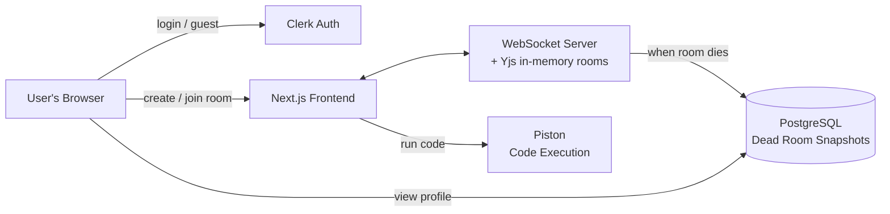
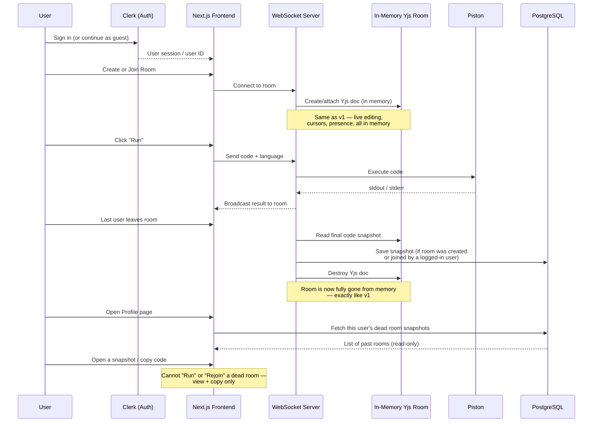

# CollabCode — Version 2 Build Checklist

> This file is written for **Claude Code**. It explains what already exists (v1), what needs to be added (v2), and shows the architecture in simple diagrams so anyone — recruiter, reviewer, or developer — can understand it quickly.

---

## 1. What v1 already does

- No accounts. Anyone can create or join a room.
- Rooms live only in server memory (Node.js + Yjs).
- Code runs through Piston.
- File is saved by downloading it — nothing stored server-side.
- Room and all its data disappear the moment everyone leaves.

**v1 has zero persistence. That is the main thing v2 changes.**

---

## 2. What v2 adds (in plain words)

1. **Login with Clerk.** Users can sign in with a real account, or continue as a guest like before.
2. **A PostgreSQL database.** Only Postgres — no Redis, no other data stores.
3. **"Dead rooms."** When everyone leaves a room, the room's final code is saved to the database and linked to the signed-in user who created it (or was in it). The live room is destroyed exactly like in v1 — but a **read-only snapshot** now survives in the user's profile.
4. **A profile page** where a logged-in user can see all their past rooms, open a snapshot, and copy the code — but **cannot** run it or rejoin it as a live room. It's dead: viewable and copyable only.
5. Guests (not logged in) behave exactly like in v1 — no history, nothing saved for them.

---

## 3. Tech stack for v2

| Layer | v1 | v2 (new/changed) |
|---|---|---|
| Frontend | Next.js | Next.js (unchanged) |
| Auth | None | **Clerk** (full auth + guest mode) |
| Real-time sync | Yjs (in-memory) | Yjs (in-memory) — unchanged |
| Backend | Node.js + WebSocket | Node.js + WebSocket — unchanged |
| Code execution | Piston (Docker) | Piston (Docker) — unchanged |
| Database | None | **PostgreSQL** (new) |
| ORM | — | Prisma or Drizzle (pick one) |
| Hosting | Vercel + Railway | Vercel + Railway (DB on Railway/Neon/Supabase) |
| File download | Single file | **JSZip** (client-side) for multi-file "Save as .zip" |

**No Redis. No other databases. Postgres only.**

---

## 4. Simple architecture diagram (high level)



**In one sentence:** live rooms still work exactly like v1 in memory, but the moment a room dies, its final snapshot is written once to Postgres so a logged-in user can find it later in their profile.

---

## 5. Detailed architecture diagram (with data flow)



---

## 6. Database schema (Postgres)

Keep it minimal — two tables: the snapshot itself, and who may read it.

```
dead_rooms
├── id              (uuid, primary key)
├── room_id         (text, UNIQUE — the original ephemeral room ID)
├── files           (jsonb — array of { filename, content }, supports multi-file rooms)
├── language        (text, NULLABLE — the room's single language, see Section 10.1)
├── is_private      (boolean — was this room password-protected)
├── participants    (jsonb — names/colors of everyone who was in the room, optional)
├── created_at      (timestamptz — when the room was first created)
└── died_at         (timestamptz — when the last person left)

dead_room_members            -- who can see this snapshot on /profile
├── dead_room_id    (uuid, FK -> dead_rooms.id, ON DELETE CASCADE)
├── user_id         (text — a *verified* Clerk user ID, never a self-reported one)
└── PRIMARY KEY (user_id, dead_room_id)
```

> Note: `code` (single string) from earlier drafts is replaced by `files` (an array) so multi-file rooms save cleanly. A single-file room is just a `files` array with one entry.

> **`owner_user_id` and its `(owner_user_id, died_at DESC)` index are gone**, replaced by
> `dead_room_members`. See Section 6.1 for why. 7.2 had already migrated the old shape, so this
> cost a **second migration** — `20260729122125_dead_room_members`, applied to both Neon
> branches during 7.3, while `dead_rooms` was still empty and nothing read it.

> The `/profile` listing is `dead_room_members` joined to `dead_rooms`, ordered by `died_at`.
> The composite primary key `(user_id, dead_room_id)` is the index that serves it — `user_id`
> leading, so one user's rows are contiguous. Sorting happens after the join, which is fine at
> v2's scale; if it ever isn't, copy `died_at` onto the member row and index
> `(user_id, died_at DESC)`.

---

### 6.1 Who a dead room belongs to

**The rule, in one line: every signed-in person who really took part gets to keep a copy;
guests keep nothing; the room itself still dies exactly like v1.**

Longer, as four rules:

1. **One snapshot per room, written once**, at the moment the room is destroyed (last socket
   closed, grace window elapsed, nobody reconnected). Never updated afterwards.
2. **A snapshot is written only if at least one participant was a verified Clerk user.** All
   guests → nothing is written at all, exactly like v1.
3. **Every verified signed-in participant who met the contribution threshold gets a
   `dead_room_members` row**, and therefore sees the room on their `/profile`. Not just the
   creator, and not just whoever left last.
4. **"Verified" means a Clerk token the *server* checked.** Never awareness state and never a
   client-supplied ID — see CLAUDE.md, "Accounts (Clerk)": a forged ID would write a
   stranger's code into someone else's profile.

**Why not "the creator owns it"** (the original draft of this section):

- The creator is frequently a guest who made the room and shared the link, which leaves the
  row with no owner at all and forces a fallback rule anyway.
- Ownership is wrong exactly when it matters most: A creates a room, leaves after two minutes,
  B works in it for an hour. A gets the snapshot; B — the person who wrote the code and will
  go looking for it — gets nothing.
- There is no such thing as an owner in `server/rooms.js` today; it records nothing about a
  room but timers. Inventing one, plus a transfer rule for when the owner leaves, is real
  complexity for behaviour no user can see or predict.

**Why not "whoever left last owns it":** it makes keeping your own work depend on tab-close
order. Close your laptop first and an hour of work silently goes to somebody else.

Membership costs nothing extra to compute: 7.3 has to verify a Clerk token per connection
regardless, which yields a *set* of signed-in users per room. Collapsing that set to one person
is the thing that would take extra work, not keeping it.

**The contribution threshold, and the trade it exists to blunt.** Under this rule, a signed-in
stranger who clicks a shared link, lurks for thirty seconds and leaves keeps a permanent
private copy of the code. So a participant earns a `dead_room_members` row only if they
**stayed more than a trivial moment** *and* **actually edited the document** — 60s of
accumulated connected time (`MEMBER_MIN_CONNECTED_MS`) plus at least one document update sent
over one of their sockets. Section 10.3's room passwords carry the rest of the weight: a
password-protected room is the "this is not public" signal, so an unprotected room being
copyable by the people who worked in it is the expected behaviour.

> **Both halves of this were rewritten during 7.3, against the original draft.**
>
> The draft said "connected **while the document was non-empty**". That cannot work:
> `useCollabRoom` seeds `DEFAULT_CODE` on the provider's `sync` event, so a room is non-empty
> within milliseconds of the *first* client connecting, and the clause filters nothing at all.
> What it was reaching for is "did this person contribute", which is directly answerable —
> y-websocket passes the WebSocket as the Yjs transaction origin, so the server knows which
> socket sent each edit. **Edits alone are what exclude the lurker**; the timer does not, since
> anyone who leaves a tab open passes it.
>
> The draft also suggested a threshold "on the order of the grace window" (10s), which
> contradicts the scenario table below — 10s cannot make a 30s lurker get nothing. 60s does.

**Deleting.** Because several accounts can hold one snapshot, "delete this from my profile"
means deleting that user's `dead_room_members` row, not the `dead_rooms` row. (Not a v2
checklist item; recorded so it isn't designed wrong later.)

#### Every scenario, in a table

A creates the room, B joins later.

| Situation | What happens |
| --- | --- |
| A signed in, B guest | A sees it on `/profile`. B gets nothing. |
| A guest, B signed in | B sees it. The guest creator needs no special case. |
| Both guests | Nothing written. Room vanishes exactly like v1. |
| Both signed in, A leaves early, B works on | **Both** see it. This is the case creator-owns gets wrong. |
| Both signed in, both leave together | Both see it. |
| B joins as a guest, signs in mid-session | B sees it, provided the server verified them before the room died. |
| Signed-in stranger lurks 30s and leaves | Nothing for them — blocked by the contribution threshold. |
| Signed-in stranger leaves a tab open for an hour but never types | Nothing for them. The 60s timer alone would not catch this; the "actually edited" half does. |
| Someone reloads the page | Nothing happens. A reload reconnects inside the grace window, so the room never died. |
| Everyone leaves, someone returns 40s later | Room is gone; `/room/<id>` sends them home. The snapshot is on `/profile` instead, read-only. |
| Room evicted twice (retry, restart) | Only the first write lands — `ON CONFLICT (room_id) DO NOTHING`, already built in 7.2. |
| Server restarts / Railway redeploys mid-room | **Saved.** 7.3's shutdown flush destroys every remaining room — live ones included — and awaits the writes, because the `unref()`'d eviction timer would otherwise never fire on SIGTERM. |

> **Corrected during 7.2, against the draft above.** `room_id` is `UNIQUE` so the database
> enforces the write-once rule below rather than trusting the writer (it also backs 7.5's
> "can never be reused"). 7.2 also added a `(owner_user_id, died_at DESC)` index for 7.4's
> listing; **7.3 dropped both that index and the column**, because §6.1 replaced creator-owns
> with `dead_room_members`, whose composite primary key `(user_id, dead_room_id)` is now the
> index that serves /profile. `language` is **nullable** because the language dropdown is a per-user editing
> preference kept deliberately off the shared Yjs doc — the server has nothing to record until
> §10.1 moves the selector to room creation, so `NOT NULL` would make 7.3 unbuildable before
> then.

Rules:
- Only written to **once**, when the last user disconnects.
- Never updated again after that — a dead room snapshot is final and read-only.
- Only saved if at least one participant was logged in via Clerk. Fully-guest rooms behave exactly like v1 (nothing saved).
- Who may read it afterwards is Section 6.1's rule, not "the creator".

---

## 7. Feature checklist for Claude Code

### 7.1 Auth (Clerk)
- [x] Install and configure Clerk in the Next.js app
- [x] Add "Sign in" / "Sign up" options on the landing page
- [x] Keep a visible "Continue as guest" option (v1 flow, unchanged)
- [x] Store Clerk user ID on the client when a room is created or joined by a logged-in user

Shipped alongside 7.1, not originally listed here:

- [x] `app/lib/clerkIdentity.ts` — the single boundary between Clerk and the app.
      Nothing else imports `useUser`, so Clerk's nullable `firstName`/`lastName` get
      sanitized exactly once, through the same `sanitizeName` guest names use.
- [x] Signing in **prefills** the name dialog rather than replacing it. A Clerk session is
      one cookie shared by every tab; a `CollabUser` is per-tab sessionStorage. Skipping
      the prompt would collapse two tabs into one collaborator and break the documented
      way to test multiplayer locally.
- [x] The dialog is never gated on Clerk having loaded. Verified: gating it left a
      deep-linked room with no prompt at all and therefore unjoinable.
- [x] Monaco is loaded from the `monaco-editor` package instead of its CDN AMD loader,
      because that loader's global `define.amd` broke Clerk's UI bundle on the room route
      (see CLAUDE.md, "Accounts (Clerk)"). Adds `monaco-editor` as a direct dependency and
      removes a runtime CDN dependency.
- [x] Clerk's components are themed with `appearance.variables` only — no `@clerk/ui`
      dependency — so the sign-in modal matches the dark app without a second bundle.

### 7.2 Database (PostgreSQL)
- [x] Provision a Postgres instance (Railway, Neon, or Supabase)
      — **Neon**, database `neondb` on `ap-southeast-1`. See the reset note below: the
      instance existed but was not empty.
- [x] Set up Prisma or Drizzle ORM with the `dead_rooms` schema above
      — **Prisma 7**, in `collab-code-editor/`: `prisma/schema.prisma` (the `DeadRoom` model)
      plus `prisma.config.ts` for the CLI.
- [x] Add environment variables for the DB connection
      — `DATABASE_URL` (pooled) and `DIRECT_URL` (unpooled, migrations only), documented in
      both `.env.example` files and CLAUDE.md's env table **and actually present** in
      `collab-code-editor/.env.local` + `server/.env`. They had been documented but never
      set, so `prisma migrate` failed on a missing datasource URL rather than on anything
      to do with the database.
- [x] Write a migration for the `dead_rooms` table
      — `prisma/migrations/20260729084725_init_dead_rooms/`. Verified applied: the table,
      the `room_id` UNIQUE index and the `(owner_user_id, died_at DESC)` index all exist,
      and `EXPLAIN` shows 7.4's profile query using that second index rather than scanning.
      (**Superseded by 7.3**: the second migration dropped that column and index — see §6.)

Shipped alongside 7.2, not originally listed here:

- [x] **The sync server does not use Prisma.** `server/db.js` is a plain `pg` pool and one
      hand-written INSERT, because that process writes one row per room in its whole life and
      never reads or updates one. Prisma there would mean a second schema copy, a
      `prisma generate` step and the query engine in the Railway image to serve a single
      statement. Same deliberate duplication as `rateLimit.js` / `rateLimit.ts`.
- [x] `DATABASE_URL` is **optional in `server/`**: unset, no pool is opened and
      `saveDeadRoom()` is a logged no-op, so the sync server still boots and serves rooms
      exactly as in v1. The guest flow stores nothing, so it must not depend on a database.
- [x] `pool.on("error", …)` in `server/db.js` — mandatory, not defensive. An idle connection
      dropped by Neon's pooler emits an `error` on the pool; unhandled it is an uncaught
      exception that would kill the sync server and every live room with it, over a database
      it was not using.
- [x] `ON CONFLICT (room_id) DO NOTHING` on the INSERT, so a retry or a restart that
      re-evicts an already-saved room cannot violate the write-once rule.
- [x] `build` is `prisma generate && next build`, not just a `postinstall` hook — Vercel
      restores a cached `node_modules` and can skip `postinstall`, producing a build that
      fails on a missing client while working locally.
- [x] `app/lib/db.ts` — the one place the app learns about Postgres, server-only, with the
      client cached on `globalThis` so Next's dev HMR does not open a new pool per edit.
- [x] Schema hardening beyond §6's draft: `UNIQUE` on `room_id` and an index on
      `(owner_user_id, died_at DESC)`. See the note in Section 6. (The index and column were
      dropped again by 7.3's migration; the `room_id` UNIQUE survives and is load-bearing.)
- [x] **The Neon database had to be reset before it could be migrated.** It already held a
      `Room` table (42 rows of `ydocState bytea`) and a `_prisma_migrations` row
      `20260706083131_init`, left over from an abandoned experiment that persisted live Yjs
      docs to Postgres — the exact thing §8 puts out of scope. Its commits are dangling
      (reachable from no branch), so the rows were orphaned. Both tables were dumped to a
      backup and dropped, giving `dead_rooms` a single clean migration history that replays
      from an empty database.
- [x] Connection strings pinned to `?sslmode=verify-full`. Neon hands out
      `?sslmode=require&channel_binding=require`, and `server/.env` had been left that way —
      node-postgres warns on every connect that pg v9 will make `require` stop verifying the
      certificate at all.
- [x] A Neon **`dev`** branch for local work, with `main` left for the deployed site.
      `collab-code-editor/.env.local` and `server/.env` point at `dev`, so local testing can
      never write rows the deployed `/profile` would read. Note a branch is a copy-on-write
      fork of its parent *at the moment it is taken*: `dev` was cut from a pre-cleanup
      snapshot and arrived carrying the same `Room` table, so it needed the same drop and a
      `prisma migrate deploy` of its own.
- [x] Acceptance test for the schema/INSERT duplication: `saveDeadRoom()` is called directly,
      the row is read back column by column, a repeat call proves `ON CONFLICT DO NOTHING`
      returns `false` instead of throwing, a snapshot with no language/participants proves the
      nullable columns, and a `DATABASE_URL`-unset process proves the no-op path. Nothing in
      the build compares `server/db.js`'s hand-written INSERT to `schema.prisma`, so this is
      the only thing that would catch a rename.

### 7.3 Dead room snapshot logic

Implements Section 6.1. Read it first — the ownership rule is the design work here; the
columns are the easy part.

- [x] **Verify a Clerk token on connect** and record the resulting user ID on the in-memory
      room. Chose `verifyToken` from `@clerk/backend` on the socket: the client sends
      `?token=`, and `server/yjsConnection.js` already discarded the query string so the
      doc-name derivation needed no change. **Never take the ID from awareness or any
      client-supplied field** — CLAUDE.md, "Accounts (Clerk)". `server/clerkAuth.js` is the one
      place a token becomes a user ID.
- [x] **Track a member set, not an owner**, on the room object: verified user ID → connect
      time, accumulated connected time, and whether they edited. `server/roomState.js`.
      A room has no owner and needs no ownership transfer.
- [x] **Apply the contribution threshold** from 6.1 — 60s of accumulated connected time **and**
      at least one document update sent over one of that user's sockets. See the correction
      below: the "document was non-empty" half of the original wording could not work.
- [x] **Record `created_at`.** `reserveRoom()` now calls `createRoomState()`, which stamps it;
      it is the only thing in the process that knows when a room was created.
- [x] On last-user-disconnect (same trigger point as v1's room cleanup), write **one**
      `dead_rooms` row plus **one `dead_room_members` row per qualifying user**, in a single
      transaction. `language` stays null until 10.1 (see Section 6's note).
- [x] If the member set is empty (all guests, or nobody cleared the threshold): skip the DB
      write entirely — behave exactly like v1. `buildSnapshot()` returns null *before* reading
      the `Y.Text`, so the common guest case never materialises the document at all.
- [x] **Cap the snapshot size.** 256 KB of UTF-8, truncated with a visible marker rather than
      dropped — losing a large room silently is worse than keeping most of it.
- [x] **Flush on shutdown.** `flushAndDestroyAll()` on SIGTERM/SIGINT destroys **every** room,
      live ones included, and awaits the writes. A live room at SIGTERM *is* a dead room that
      has not noticed: the registry dies with the process, so flushing only in-grace rooms
      would save the rooms nobody was using and lose every room someone was working in.
- [x] Destroy the in-memory Yjs doc exactly as v1 already does, regardless of whether a
      snapshot was saved — snapshot building is wrapped in `try/catch` and the destroy is in a
      `finally`, because an uncaught throw inside the eviction `setTimeout` would kill the
      process and every other live room.
- [x] **Second migration**: `20260729122125_dead_room_members` drops `dead_rooms.owner_user_id`
      and its `(owner_user_id, died_at DESC)` index and creates `dead_room_members`.
      `server/db.js`'s hand-written INSERT was updated to match — nothing in the build compares
      it to `schema.prisma` (see 7.2's acceptance-test note), so it was re-verified by running
      it and reading both tables back.

**Corrected while building 7.3 — the checklist above was wrong twice:**

- [x] **The contribution threshold's "document was non-empty" clause was unimplementable.**
      `useCollabRoom` seeds `DEFAULT_CODE` on the provider's `sync` event, so every room is
      non-empty within milliseconds of the *first* client connecting. The clause therefore
      filtered nothing — and what it was filtering on was boilerplate nobody wrote. Replaced
      with "actually edited", which is what it was reaching for and which is what genuinely
      excludes the lurker: y-websocket passes the WebSocket as the Yjs transaction origin
      (`readSyncMessage(decoder, encoder, doc, conn)`), so `doc.on("update")` identifies who
      sent each edit. Section 6.1's prose was updated to match.
- [x] **§6.1's threshold prose contradicted its own scenario table.** The prose suggested "on
      the order of the grace window" (10s) while the table requires a 30s lurker to get
      nothing. 60s (`MEMBER_MIN_CONNECTED_MS`) satisfies the table; the prose was rewritten.

Shipped alongside 7.3, not originally listed here:

- [x] **Verification never refuses a socket.** A bad, expired or missing token, an unset
      `CLERK_SECRET_KEY` and a Clerk outage all mean the same thing: no membership recorded,
      room otherwise untouched. CLAUDE.md already documents what gating on Clerk costs — a
      deep-linked room that could not be joined at all — and gating the *socket* would be the
      same bug one layer down. A missing token costs a profile entry; a missing socket costs
      the room.
- [x] **`CLERK_SECRET_KEY` is optional in `server/`**, exactly like `DATABASE_URL`: unset, no
      token is verified, no room has members, nothing is written, and the guest flow — which
      is the whole of v1 — runs without auth infrastructure it never touches.
- [x] **A `pendingEdits` set, to close a race that silently lost snapshots.** Verification is
      asynchronous and the first call of a process fetches Clerk's JWKS (~200ms measured),
      while a client syncs and starts typing in ~50ms. Every edit in that window was
      attributed to nobody, so the user failed the `didEdit` half of the threshold and lost
      their snapshot. It reproduced consistently for the **first signed-in user after every
      restart** and vanished for everyone after, because the JWKS cache then wins the race.
- [x] **Shutdown closes sockets with 1012 (Service Restart), not 4404.** The client treats 4404
      as permanent — it calls `provider.disconnect()` and shows the closed screen forever —
      which is exactly wrong for a redeploy. Every other close code keeps y-websocket retrying.
      No client change was needed.
- [x] **`GET /health` answers 503 once shutting down**, so Railway stops routing to a draining
      container (`railway.json` already points its healthcheck there).
- [x] **The token is refreshed on reconnect.** y-websocket serialises `params` into
      `this.url` **once, in its constructor**, but `setupWS` re-reads `provider.url` on every
      dial. A Clerk session token lives ~60s, so without rewriting that url every reconnect
      after the first minute would carry a dead token and the user's connected time would
      silently stop accruing mid-session.
- [x] **`participants` is populated**, accumulated from awareness over the room's life and
      sanitized server-side. It cannot be read at eviction: y-websocket's `closeConn` strips
      awareness state per socket, so a dying room's awareness is already empty.
- [x] **`server/db.js`'s write is a real transaction.** `pool.query("BEGIN")` is *not* one —
      with `max: 3` the BEGIN, the INSERTs and the COMMIT can land on three different pooled
      connections, so the inserts run outside the transaction and the COMMIT commits nothing.
      It fails silently, because the rows still appear.
- [x] **End-to-end verification**, 40 assertions headless plus a real-browser pass: guest-only
      rooms store nothing; a signed-in editor gets a row and a member row; a lurker is excluded
      while the editor is still saved; a sub-threshold session is excluded; two tabs on one
      account produce one member row; a refresh inside the grace window writes nothing and
      keeps membership; a 300 KB document with emoji at the cut truncates without corrupting
      jsonb; SIGTERM flushes a live room in ~500ms; both degraded configs still serve rooms;
      and the 4404 path, the always-200 `GET /rooms/:id` and the no-socket `RoomGate` invariant
      all still hold. The browser pass drove a real Clerk sign-in and confirmed the socket URL
      carries a token and the resulting member row is the verified Clerk user ID.
- [x] **An unpaired surrogate anywhere in a snapshot silently lost the whole room** — found
      while building 7.4, fixed there, recorded here because it is 7.3's write path. A lone
      surrogate cannot be stored: `JSON.stringify` emits a bare `\ud83d` and Postgres rejects
      the *entire* INSERT with `unsupported Unicode escape sequence`, so `saveDeadRoom`
      returned `"failed"` and the code went with it. Two ways in, both reachable by a peer:
      `sanitizeName`'s `.slice(0, 24)` counted UTF-16 code units and could halve a surrogate
      pair, so one participant's emoji name destroyed everyone's snapshot; and `snapshotText`
      only repaired the document on its *truncating* branch (`Buffer.toString("utf8")`
      substitutes U+FFFD), so a lone surrogate in a document **under** 256 KB was returned
      untouched. Both now go through one `stripUnstorable`, and the name cut is by code point.
      `app/lib/user.ts`'s copy of `sanitizeName` got the identical change so the two do not
      drift.

### 7.4 Profile page
- [x] New route: `/profile` — `app/profile/page.tsx`, an async Server Component. Plus
      `app/profile/[deadRoomId]/page.tsx` for one snapshot, with its own `not-found.tsx`
      and a shared `error.tsx`.
- [x] Protected — only accessible to logged-in users. `await auth()` **in the page**, not in
      `proxy.ts`: `clerkMiddleware()` stays callback-free so the guest flow keeps reaching
      `/`, `/room/*` and `/api/execute`, and Clerk deprecates `createRouteMatcher` in favour
      of exactly this. A signed-out visitor gets an in-page gate with a `SignInButton`, not a
      redirect — see the correction below.
- [x] List every `dead_rooms` row the current user has a `dead_room_members` row for,
      newest `died_at` first (Section 6.1 — a room can legitimately appear on more than one
      person's profile). It is a join from `dead_room_members`, never a filter on
      `dead_rooms`; see the security note below.
- [x] Show room name/date/language for each — **as far as the schema allows**. See the
      correction below: there is no room name, and `language` is null on every row.
- [x] Clicking a room opens a **read-only** code view — a static `<pre>` with a sticky
      line-number gutter, not a read-only Monaco. See the correction below.
- [x] Add a "Copy code" button — `app/components/SnapshotActions.tsx`, reusing
      `hooks/useCopyToClipboard.ts` and the copied-tick + `aria-live` pattern from
      `EditorToolbar`'s room-ID chip.
- [x] Explicitly disable/hide any "Run" or "Rejoin" button on dead rooms — make it visually
      clear the room is closed. Both are rendered **disabled**, not hidden: a control that is
      visibly off with a reason in its `title` says "this room is dead", where an absent one
      is indistinguishable from a feature nobody built. Reinforced by a "Closed room ·
      read-only snapshot" badge and a padlock on every card.

**Corrected while building 7.4 — three of the bullets above could not be built as written:**

- [x] **There is no room name to show.** `dead_rooms` has no name column and never had one:
      a room is minted by `POST /rooms` as a bare UUID and nobody ever titles it. The
      original `room_id` is therefore the name, rendered in mono so it is recognisable
      against a link someone still has open. Naming rooms is not a v2 item; if it becomes
      one, §10 is where it belongs.
- [x] **`language` is null on 100% of rows, so the listing says "not recorded".** Not a
      placeholder to backfill — the language dropdown is a per-user editing preference kept
      deliberately off the shared `Y.Doc`, so the server has no single answer until §10.1
      moves the selector to room creation. `is_private` is likewise `false` on every row
      until §10.3, and is not rendered at all rather than shown as a meaningless "public".
- [x] **The read-only view is a `<pre>`, not a read-only Monaco.** Three reasons, in order:
      an editor is the one widget on this site that means "you can type here", which is the
      opposite of what the last bullet above asks for; there is nothing to highlight while
      `language` is null, so Monaco would load ~5 MB to render plaintext; and
      `lib/monacoLoader.ts` imports `monaco-editor` at module scope, which is why
      `/room/[roomId]` returns HTTP 500 from the server on every request — keeping it out of
      this route's import graph is what lets `/profile` actually server-render. Verified:
      `/profile` answers 200 where `/room/<id>` answers 500.

Shipped alongside 7.4, not originally listed here:

- [x] **`app/lib/deadRooms.ts` — the read boundary, with one hard rule: a `DeadRoom` is never
      fetched by its id.** Both queries start from `deadRoomMember` keyed on the *viewer's*
      Clerk user ID and reach the room through the relation, so a snapshot the viewer holds
      no membership row for is not "hidden by a filter we remembered to add" — it is
      unfetchable. §6.1 puts one room on several profiles, so there is no ownership column
      that could do this job instead. The detail lookup is `findUnique` on the composite
      primary key `(user_id, dead_room_id)`, which makes the authorization check and the
      index lookup the same query.
- [x] **`readSnapshotFiles()` narrows the `files` column**, the same way `lib/awareness.ts`'s
      `readPeers` narrows peer state. Prisma types `files` as `JsonValue` and guarantees
      nothing; filenames are additionally reduced to a safe basename because one is handed to
      an `<a download>`.
- [x] **The detail URL carries `dead_rooms.id`, not `room_id`** — it makes the membership key
      and the URL the same value, and a `/profile/<id>` sharing its id with a live
      `/room/<id>` would invite exactly the confusion the page exists to prevent. A malformed
      UUID is rejected by a regex *before* the query, because `id` is a Postgres `uuid` and
      would otherwise 500 on `invalid input syntax for type uuid`.
- [x] **"No such saved room" is one answer for two causes** — no such row, and not yours — so
      the URL cannot be used to probe which snapshot ids exist.
- [x] **A "My rooms" link on the landing page**, shown next to `<UserButton>` when signed in.
      Without it `/profile` is reachable only by typing the URL.
- [x] **A Download button** beside Copy, reusing `lib/download.ts`. It is the same promise v1
      made about Save — "saving a file means downloading it to your device" — and is neither
      a Run nor a Rejoin, so it fits §8's read-only rule.
- [x] **A truncation notice.** A snapshot cut at the 256 KB cap ends with a C-style marker
      that would otherwise appear as a mystery comment in someone's Python. The content is
      still rendered and copied *verbatim*, so what you see is what you copy.
- [x] **`error.tsx` distinguishes "database unreachable" from "you have no rooms"** — the
      same `missing` vs `unreachable` split `RoomGate` draws for a room, and a live case
      because Neon autosuspends an idle branch. It uses Next 16.2's **`unstable_retry`**, not
      `reset`, which was demoted to "re-render without re-fetching".
- [x] **No `loading.tsx`, deliberately.** A Suspense boundary in `app/profile/` would also
      wrap `[deadRoomId]`, and once a response starts streaming its status is already sent —
      `notFound()` would then render the 404 UI under a 200. Verified: the not-found route
      answers a real 404.
- [x] **The listing is capped at 100 rows and says so when the cap bites**, and it does not
      select `files`: a snapshot is up to 256 KB, so a full page of them would pull ~25 MB out
      of Neon to render metadata cards. That is also why the cards carry no code preview.
- [x] **End-to-end verification**: 15 browser assertions through a real Clerk sign-in
      (listing contents and order, another account's room absent and its snapshot URL a 404,
      code byte-identical, clipboard contents, downloaded file name and bytes, both dead
      controls disabled with no enabled Run/Rejoin anywhere, the truncation notice); 4 more
      driving a **real room to death** at the real 60s threshold and 10s grace, confirming it
      lands at the top of `/profile` with the text that was actually typed while a
      simultaneous guest room stored nothing; 5 more forcing an unreachable database to prove
      `error.tsx` renders and retries; plus `/profile` 200 vs `/room/<id>` 500, a malformed
      UUID 404, and `lint`/`tsc`/`build` clean.

### 7.5 Guardrails
- [x] A dead room's original `room_id` can never be reused to rejoin a live session
      — **already true since v1; ticked on verification, not on new code.** Three
      independent things enforce it and none was added here: IDs are minted as
      `crypto.randomUUID()` (`server/rooms.js`), so one is never handed out twice;
      `roomExists()` is a pure in-memory lookup over `docs` + `reservations`, so a
      destroyed ID is unknown forever and a restart makes *every* old ID unknown;
      and `room_id` is `UNIQUE` with `ON CONFLICT DO NOTHING`, so even a repeat
      write cannot revive one. Verified rather than assumed — see the note below.
- [x] If someone visits `/room/<old-dead-id>`, redirect home (same as v1's "room doesn't exist" behavior)
      — **also already true; verified in a real browser.** `checkRoom` →
      `{"exists": false}` → `RoomGate`'s `missing` state → a "This room has
      closed" screen, a 3-second countdown, and `router.replace("/")`. `replace`,
      not `push`, so Back cannot land in the dead room again.
- [x] Rate-limit DB writes the same way v1 rate-limits room creation
      — **the only bullet that needed building.** `server/snapshotQueue.js`: the
      same sliding window from `rateLimit.js` that `POST /rooms` uses, keyed on
      the room creator's IP, plus a concurrency cap at `db.POOL_MAX`. It **defers
      rather than refuses** — see the correction below.

**Corrected while building 7.5 — the first two bullets could not be built as written:**

- [x] **There was nothing to implement for bullets 1 and 2.** Both describe
      behaviour v1 already had, and CLAUDE.md explicitly says not to tick 7.5 on
      that basis alone. So they were driven end to end instead: a room was taken
      through its real lifecycle to death, then `GET /rooms/:id` was confirmed to
      answer `{"exists": false}`, a raw WebSocket to that ID was closed with
      **4404**, `GET` was re-checked afterwards to prove the probe had not
      resurrected it, an ID the server never issued was refused identically, and a
      browser visiting the dead URL was watched being sent home. Building anything
      new here would have been a second, weaker copy of a gate that already works.
- [x] **"Rate-limit DB writes" cannot mean "refuse them".** `POST /rooms` answers
      429 and the caller retries; a snapshot has no caller left to retry — the room
      is already destroyed and its document freed, so a refused write destroys the
      only copy of that work. Worse, the legitimate case that trips a per-IP limit
      is a **shared NAT**: one office or classroom egress IP closing thirty rooms
      at 5pm, not an attacker. So the limiter paces and defers, and the only thing
      that ever discards is the queue's own memory bound.

Shipped alongside 7.5, not originally listed here:

- [x] **A concurrency cap, which fixed a real bug 7.5 never mentioned.**
      `destroyRoom()` fired `saveDeadRoom()` and forgot it, so N rooms dying at
      once meant N concurrent `pool.connect()` calls against a pool of 3.
      Everything past the third waits in pg-pool's pending queue, where
      `connectionTimeoutMillis` eventually rejects it — and the room is gone, so
      there is nothing to retry from. **Measured before the fix: 10 rooms dying
      together, 3 saved, 7 lost**, exactly the pool size, with
      `timeout exceeded when trying to connect` in the log. **Same experiment
      after: 10 of 10 saved.** Every Railway redeploy took this path, because the
      shutdown flush destroys every room at once.
- [x] **`died_at` is now bound by the writer instead of defaulting to `now()`.**
      Once a write can be paced, `now()` records when Postgres was reached rather
      than when the last person left — and `/profile` both **sorts** the listing on
      `died_at` and renders `died_at - created_at` as each room's lifetime, so a
      deferred room would sort below a later one and claim a longer life. Verified:
      10 rooms whose writes were paced across ~15s came back with an **8ms**
      `died_at` spread and identical lifetimes.
- [x] **`saveDeadRoom`'s "never throws" is now actually true.** `pool.connect()`
      sat on the line *above* the `try`, so all three of its rejection paths
      escaped — survivable only because the old call site attached a `.catch`.
      Under a queue whose worker chain has no other catcher, that would have become
      an unhandled rejection, which is fatal by default and would take every live
      room with it.
- [x] **The shutdown flush releases pacing before it destroys anything.** A room
      that died earlier can be sitting behind a pacing timer when SIGTERM arrives.
      By then `server.close()` has released the listening handle, signal handles
      never anchored the event loop, and the timer is `unref()`'d — so Node would
      exit with those snapshots still in memory. Verified: 8 rooms parked behind a
      60-second timer, SIGTERM, **all 8 written and the process exited in 6.8s**.
- [x] **Every terminal path in the queue resolves, including a dropped one.** An
      entry whose promise never settles sits in `pendingWrites` forever, which
      would make `flushAndDestroyAll`'s `Promise.race` always resolve via its
      deadline branch — turning every shutdown, healthy or not, into a full
      20-second wait.
- [x] **A per-key occupancy cap on the queue.** With only a global bound, one
      caller's deferred entries could fill it and every *other* room's snapshot
      would then be dropped at the door — the limiter would have converted abuse
      into a queue and the queue into somebody else's data loss. Same argument as
      `MAX_RESERVATIONS` vs. the per-IP limiter: a global ceiling and a per-caller
      bound do different jobs.
- [x] **The queue is bounded in bytes, not just entries.** A snapshot is up to
      256 KB, so "64 entries" is 0.1 MB of ordinary rooms or 16 MB of capped ones.
      Tens of MB competes with the Y.Docs of *live* rooms on a Railway container,
      and an OOM there loses the queue **and** every live room — strictly worse
      than the unbounded writes it replaced.
- [x] **The pacing default is 60/min, not the 10 `POST /rooms` uses.** Room
      creation is already capped at 10/min/IP and a snapshot additionally requires
      a signed-in member who stayed 60s *and* edited, so 10 here would essentially
      never bind on abuse while binding constantly on the shared-NAT case.
      `SNAPSHOT_WRITE_LIMIT` / `SNAPSHOT_WRITE_WINDOW_MS` make it tunable, and
      lowering them is how the deferral path is exercised in seconds.
- [x] **The creator's IP never leaves memory.** It is recorded once, at
      `POST /rooms` — the only moment a room and an address are ever in the same
      place, since `destroyRoom` has no request and no socket — carried on the
      in-memory room state, and used solely as the pacing key. It is not a column,
      the INSERT lists its columns explicitly, and the queue's logs print room IDs
      and depths only. Verified: no address appears in the server log, and
      `dead_rooms` still has exactly its eight columns.
- [x] **The exit backstop is armed before `db.close()`, not after.** `pool.end()`
      waits for every checked-out client and the pool sets no `statement_timeout`,
      so a query wedged against an unresponsive Neon hung that await forever — and
      a backstop created afterwards was never reached, leaving only the platform's
      SIGKILL.
- [x] **End-to-end verification**: 12 headless assertions (a guest-only room still
      stores nothing; a dead room's ID answers `exists:false`, closes a raw socket
      with 4404 and is not resurrected by the probe; an unissued ID is refused
      identically; `GET /rooms/:id` still never 404s; `POST /rooms` still 429s with
      `Retry-After` and its own wording; no client address in the log; the schema
      still has nowhere to put one), 11 browser assertions through real Chrome (the
      closed-room screen, the countdown, the redirect home, Back not returning, and
      a two-tab room still syncing, showing presence and broadcasting a Run with
      its attribution), and seven write-path scenarios: the before/after burst,
      40 rooms at default settings, deferral under a deliberately tiny window,
      writes parked behind a 60s timer through a SIGTERM, `died_at` fidelity, and
      the real 60-second membership threshold. Plus `lint`, `tsc` and `build`
      clean, `/room/<id>` 200 with zero Monaco in the server-rendered HTML,
      `/profile` 200 and `/nosuchpage` a real 404.

### 7.6 Housekeeping (not originally listed; recorded because it shipped)

- [x] **Full end-to-end verification pass** driven through a real browser (Playwright against
      system Chrome; nothing was added to either workspace's dependencies, and the scripts are
      deliberately not committed — this repo has no test harness and 7.x did not ask for one).
      77 assertions, all passing: landing and Clerk chrome; room create/join; Yjs sync both
      ways and concurrent-edit merge; presence, remote-cursor styling and <300 ms departure
      (the `disableBc` regression); Run in all five languages against live Piston; the output
      cap, OOM and timeout notices, and the deliberate *absence* of a notice on a plain
      non-zero exit; per-user Save filenames (`main.cpp` vs `Main.java` from one document);
      copy; room eviction measured at 10.2 s against a 10 s `ROOM_GRACE_MS`; `missing` vs
      `unreachable` vs rate-limited kept distinct; the `RoomGate` no-socket invariant;
      hostile-peer CSS injection and a 10 000-character name; name/colour collision resolved
      identically for two viewers; the 413 payload cap; both rate limiters; the 25 s stale-run
      watchdog healing an abandoned run at 24.3 s; and the full signed-in flow including the
      invariant that `clerkUserId` never appears in awareness (read off the wire by a raw Yjs
      client, not from the UI).
- [x] Corrected two claims in `CLAUDE.md` that testing disproved: missing Clerk keys do **not**
      500 a production start, and `GET /rooms/:roomId` never returns 404 — it always answers
      200 with `{"exists": …}`.
- [x] Split the 810-line `CodeEditor.tsx` into composable parts before v2 adds multi-file,
      chat and passwords to the same screen: the Yjs stack moved to `hooks/useCollabRoom.ts`,
      Run to `hooks/useCodeRunner.ts`, and the chrome to `EditorToolbar` / `OutputPanel` /
      `JoinRoomPrompt`. Behaviour unchanged — verified with a two-tab browser run of sync,
      presence, join/leave toasts, shared Run, error output, copy and Save.

### 7.7 UI/UX redesign (not originally listed; recorded because it shipped)

A full visual and interaction pass over every screen, requested directly rather than from this
checklist. **No behavioural change to sync, presence, execution, auth or persistence** — the
whole point was that the room keeps working exactly as 7.1–7.4 left it.

- [x] **A real design system.** `app/globals.css` went from six dark-only colours to semantic
      light *and* dark tokens (`--app`/`--panel`/`--raised`/`--edge`/`--fg`/`--accent`/
      `--success`/`--danger`/`--warning`/`--code-bg`), surfaced to Tailwind with
      `@theme inline` so one class on `<html>` re-resolves every utility. The ~200 literal
      `zinc-*`/`emerald-*`/`amber-*`/`red-*` classes and the hardcoded `#2c2c2c`, `#101010`
      and `#1f1414` hexes were swept onto tokens.
- [x] **Light/dark theme with a three-way Light/System/Dark toggle**, defaulting to the OS
      preference and persisted in `localStorage`. Includes the no-flash inline `<head>` script,
      Monaco themes matching `--code-bg`, and Clerk's `appearance` following the theme — which
      is why `ClerkProvider` moved into a client `AppProviders`.
- [x] **A freely resizable editor/output split** via `react-resizable-panels` v4: drag to
      resize, a button to switch between side-by-side and stacked, collapse/expand, sizes and
      orientation persisted. Keyboard-resizable and double-click-to-reset come from the
      library's `Separator`.
- [x] **The two chrome rows became one.** `EditorToolbar.tsx` and `UserBar.tsx` were deleted
      and replaced by `RoomChrome.tsx` + `PresenceStack.tsx`, roughly halving the vertical
      space above the editor. Nothing was dropped: room id, sync state, presence, language,
      Run and Save are all still there, plus the theme toggle.
- [x] **Responsive across the whole app**, where before there was exactly one breakpoint in
      the codebase. Phones get a forced stack, a wrapping chrome bar (no controls hidden), word
      wrap in Monaco, and `h-dvh` so the URL bar stops clipping the output panel.
- [x] **Designed failure screens**: root `not-found.tsx`, `error.tsx` and `global-error.tsx`.
      Still no `loading.tsx` anywhere — a Suspense boundary would start streaming and turn
      every real 404 into a soft 200.
- [x] **Fixed the long-standing `/room/[roomId]` HTTP 500.** `RoomGate` now loads the editor
      through `dynamic(..., { ssr: false })`, so the route server-renders for the first time.
      This was not cosmetic: the no-flash theme script lives in the root layout's `<head>`, and
      a route that 500s never ships one.
- [x] **Deduplicated the copy-pasted button styles** into `app/lib/ui.ts`. `primaryButton` and
      `secondaryButton` had been declared byte-for-byte in both `ProfileShell.tsx` and
      `RoomGate.tsx`.
- [x] **Accessibility and polish**: a focus trap in `IdentityDialog` (it is `aria-modal` but
      Tab used to walk straight out of it), the first/last-name row stacking on narrow screens,
      the full eight-colour cursor palette instead of a Shuffle-only button, a consistent
      `focus-visible` ring, toasts clear of the mobile browser chrome, and a favicon
      (`app/icon.svg`) where the app previously 404'd on every page load.
- [x] **Verified end to end in a real browser**, two tabs: presence, sync, shared Run with
      attribution, and — the load-bearing one — that dragging, flipping orientation, collapsing
      and expanding, and switching theme all leave the shared output and editor contents intact
      in *both* tabs. That is the assertion that proves `<Editor>` never remounted and the Yjs
      stack was never torn down. Plus `/room/<id>` and `/profile` both answering 200,
      `/nosuchpage` a real 404, and no Monaco in any server-rendered HTML.

---

## 8. Explicitly out of scope for v2

- Redis or any cache/session store beyond Postgres
- Re-running or re-joining a dead room
- Editing a dead room's saved code in place
- Real-time collaboration on dead rooms (they are static, read-only)
- Horizontal scaling across multiple server instances (still a v3+ concern)

---

## 9. Suggested build order for v2

1. Add Clerk auth to the existing Next.js app (guest mode still default)
2. Set up PostgreSQL + ORM + `dead_rooms` table
3. Hook the existing "last user disconnects" cleanup logic to write a snapshot before destroying the Yjs doc
4. Build the `/profile` page (list + read-only view + copy button)
5. Add guardrails so dead rooms can never be rejoined or re-run
6. Test: guest-only room (nothing saved) vs logged-in room (snapshot saved and visible in profile)

---

## 10. Extra features for v2

### 10.1 Multi-file support

**How it works:** Language is chosen once, at room creation (dropdown just moves here instead of living inside the editor). Every new file in that room automatically gets the right extension for that language. One file is marked as the **entry file** (a small star on its tab) — that's the one "Run" executes. Saving works two ways:
- Only 1 file in the room → downloads that file directly, like v1.
- 2+ files → "Save" zips everything into `project.zip` (via JSZip). Each file tab also has its own "download this file only" option.

- [ ] Move language selector from editor toolbar to room-creation screen
- [ ] Add "+ New file" button; auto-suggest correct extension based on room language
- [ ] Each file = its own Yjs sub-document, shown as tabs
- [ ] Right-click a tab → "Set as entry file" (starred, visible to everyone in room)
- [ ] "Run" always executes the entry file
- [ ] Save: single file → direct download; multiple files → zip via JSZip
- [ ] Per-file "download this file only" option in each tab's menu
- [ ] `dead_rooms.files` stores the full file array on snapshot (see Section 6)

### 10.2 In-room chat

**How it works:** A small chat sidebar next to the editor, sent over the **same WebSocket connection** already used for Yjs — no new server or database needed. Messages are not saved anywhere; they disappear with the room, same as everything else in v1's philosophy.

- [ ] Add a chat panel/sidebar to the room page
- [ ] Broadcast chat messages over the existing WebSocket connection (new message type, not Yjs)
- [ ] Show sender name + assigned color on each message
- [ ] Do **not** persist chat history — it dies with the room, even for logged-in users

### 10.3 Room password / private rooms

**How it works:** An optional password field at room creation. If set, joining that room requires entering the same password first. The password itself is never stored in plaintext or in Postgres long-term — it only lives in the server's in-memory room object (same lifetime as the room itself), so it disappears automatically when the room dies.

- [ ] Optional "Set a password" field on room creation
- [ ] Store the password hash in the in-memory room object only (not the database)
- [ ] Join flow: if room has a password, prompt for it before connecting to the WebSocket/Yjs doc
- [ ] Wrong password → clear error, no connection made
- [ ] `dead_rooms.is_private` flag records whether the snapshot came from a password-protected room (for display purposes only — the password itself is never saved)
