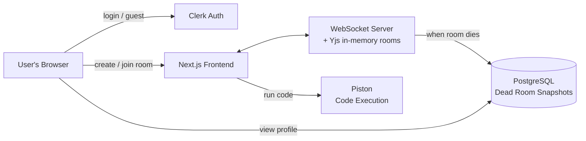
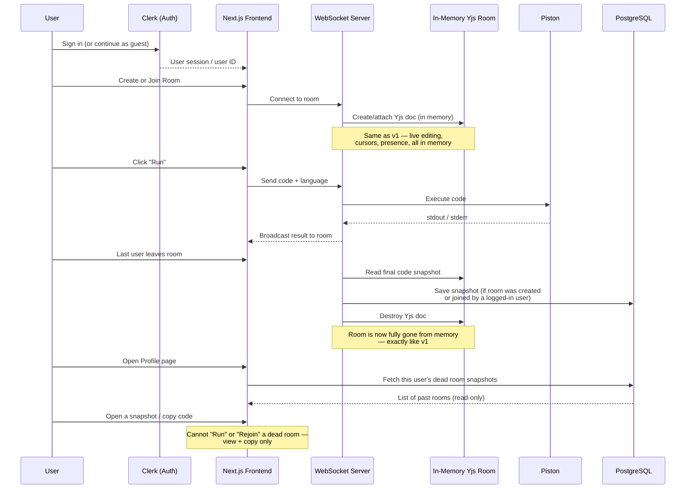

# CollabCode — Version 2 Build Checklist

> This file is written for **Claude Code**. It explains what already exists (v1), what needs to be added (v2), and shows the architecture in simple diagrams so anyone — recruiter, reviewer, or developer — can understand it quickly.

---

## 1. What v1 already does

- No accounts. Anyone can create or join a room.
- Rooms live only in server memory (Node.js + Yjs).
- Code runs through Piston.
- File is saved by downloading it — nothing stored server-side.
- Room and all its data disappear the moment everyone leaves.

**v1 has zero persistence. That is the main thing v2 changes.**

---

## 2. What v2 adds (in plain words)

1. **Login with Clerk.** Users can sign in with a real account, or continue as a guest like before.
2. **A PostgreSQL database.** Only Postgres — no Redis, no other data stores.
3. **"Dead rooms."** When everyone leaves a room, the room's final code is saved to the database and linked to the signed-in user who created it (or was in it). The live room is destroyed exactly like in v1 — but a **read-only snapshot** now survives in the user's profile.
4. **A profile page** where a logged-in user can see all their past rooms, open a snapshot, and copy the code — but **cannot** run it or rejoin it as a live room. It's dead: viewable and copyable only.
5. Guests (not logged in) behave exactly like in v1 — no history, nothing saved for them.

---

## 3. Tech stack for v2

| Layer | v1 | v2 (new/changed) |
|---|---|---|
| Frontend | Next.js | Next.js (unchanged) |
| Auth | None | **Clerk** (full auth + guest mode) |
| Real-time sync | Yjs (in-memory) | Yjs (in-memory) — unchanged |
| Backend | Node.js + WebSocket | Node.js + WebSocket — unchanged |
| Code execution | Piston (Docker) | Piston (Docker) — unchanged |
| Database | None | **PostgreSQL** (new) |
| ORM | — | Prisma or Drizzle (pick one) |
| Hosting | Vercel + Railway | Vercel + Railway (DB on Railway/Neon/Supabase) |
| File download | Single file | **JSZip** (client-side) for multi-file "Save as .zip" |

**No Redis. No other databases. Postgres only.**

---

## 4. Simple architecture diagram (high level)



**In one sentence:** live rooms still work exactly like v1 in memory, but the moment a room dies, its final snapshot is written once to Postgres so a logged-in user can find it later in their profile.

---

## 5. Detailed architecture diagram (with data flow)



---

## 6. Database schema (Postgres)

Keep it minimal — one table is enough for v2.

```
dead_rooms
├── id              (uuid, primary key)
├── room_id         (text — the original ephemeral room ID)
├── owner_user_id   (text — Clerk user ID of the creator)
├── files           (jsonb — array of { filename, content }, supports multi-file rooms)
├── language        (text — the room's single language, see Section 10.1)
├── is_private      (boolean — was this room password-protected)
├── participants    (jsonb — names/colors of everyone who was in the room, optional)
├── created_at      (timestamp — when the room was first created)
└── died_at         (timestamp — when the last person left)
```

> Note: `code` (single string) from earlier drafts is replaced by `files` (an array) so multi-file rooms save cleanly. A single-file room is just a `files` array with one entry.

Rules:
- Only written to **once**, when the last user disconnects.
- Never updated again after that — a dead room snapshot is final and read-only.
- Only saved if at least one participant was logged in via Clerk. Fully-guest rooms behave exactly like v1 (nothing saved).

---

## 7. Feature checklist for Claude Code

### 7.1 Auth (Clerk)
- [ ] Install and configure Clerk in the Next.js app
- [ ] Add "Sign in" / "Sign up" options on the landing page
- [ ] Keep a visible "Continue as guest" option (v1 flow, unchanged)
- [ ] Store Clerk user ID on the client when a room is created or joined by a logged-in user

### 7.2 Database (PostgreSQL)
- [ ] Provision a Postgres instance (Railway, Neon, or Supabase)
- [ ] Set up Prisma or Drizzle ORM with the `dead_rooms` schema above
- [ ] Add environment variables for the DB connection
- [ ] Write a migration for the `dead_rooms` table

### 7.3 Dead room snapshot logic
- [ ] On last-user-disconnect (same trigger point as v1's room cleanup), check if any participant was a logged-in (Clerk) user
- [ ] If yes: write one row to `dead_rooms` with the final code, language, and participant list
- [ ] If no (all guests): skip DB write entirely — behave exactly like v1
- [ ] Destroy the in-memory Yjs doc exactly as v1 already does, regardless of whether a snapshot was saved

### 7.4 Profile page
- [ ] New route: `/profile`
- [ ] Protected — only accessible to logged-in users
- [ ] List all `dead_rooms` rows where `owner_user_id` matches the current user
- [ ] Show room name/date/language for each
- [ ] Clicking a room opens a **read-only** code view
- [ ] Add a "Copy code" button
- [ ] Explicitly disable/hide any "Run" or "Rejoin" button on dead rooms — make it visually clear the room is closed

### 7.5 Guardrails
- [ ] A dead room's original `room_id` can never be reused to rejoin a live session
- [ ] If someone visits `/room/<old-dead-id>`, redirect home (same as v1's "room doesn't exist" behavior)
- [ ] Rate-limit DB writes the same way v1 rate-limits room creation

---

## 8. Explicitly out of scope for v2

- Redis or any cache/session store beyond Postgres
- Re-running or re-joining a dead room
- Editing a dead room's saved code in place
- Real-time collaboration on dead rooms (they are static, read-only)
- Horizontal scaling across multiple server instances (still a v3+ concern)

---

## 9. Suggested build order for v2

1. Add Clerk auth to the existing Next.js app (guest mode still default)
2. Set up PostgreSQL + ORM + `dead_rooms` table
3. Hook the existing "last user disconnects" cleanup logic to write a snapshot before destroying the Yjs doc
4. Build the `/profile` page (list + read-only view + copy button)
5. Add guardrails so dead rooms can never be rejoined or re-run
6. Test: guest-only room (nothing saved) vs logged-in room (snapshot saved and visible in profile)

---

## 10. Extra features for v2

### 10.1 Multi-file support

**How it works:** Language is chosen once, at room creation (dropdown just moves here instead of living inside the editor). Every new file in that room automatically gets the right extension for that language. One file is marked as the **entry file** (a small star on its tab) — that's the one "Run" executes. Saving works two ways:
- Only 1 file in the room → downloads that file directly, like v1.
- 2+ files → "Save" zips everything into `project.zip` (via JSZip). Each file tab also has its own "download this file only" option.

- [ ] Move language selector from editor toolbar to room-creation screen
- [ ] Add "+ New file" button; auto-suggest correct extension based on room language
- [ ] Each file = its own Yjs sub-document, shown as tabs
- [ ] Right-click a tab → "Set as entry file" (starred, visible to everyone in room)
- [ ] "Run" always executes the entry file
- [ ] Save: single file → direct download; multiple files → zip via JSZip
- [ ] Per-file "download this file only" option in each tab's menu
- [ ] `dead_rooms.files` stores the full file array on snapshot (see Section 6)

### 10.2 In-room chat

**How it works:** A small chat sidebar next to the editor, sent over the **same WebSocket connection** already used for Yjs — no new server or database needed. Messages are not saved anywhere; they disappear with the room, same as everything else in v1's philosophy.

- [ ] Add a chat panel/sidebar to the room page
- [ ] Broadcast chat messages over the existing WebSocket connection (new message type, not Yjs)
- [ ] Show sender name + assigned color on each message
- [ ] Do **not** persist chat history — it dies with the room, even for logged-in users

### 10.3 Room password / private rooms

**How it works:** An optional password field at room creation. If set, joining that room requires entering the same password first. The password itself is never stored in plaintext or in Postgres long-term — it only lives in the server's in-memory room object (same lifetime as the room itself), so it disappears automatically when the room dies.

- [ ] Optional "Set a password" field on room creation
- [ ] Store the password hash in the in-memory room object only (not the database)
- [ ] Join flow: if room has a password, prompt for it before connecting to the WebSocket/Yjs doc
- [ ] Wrong password → clear error, no connection made
- [ ] `dead_rooms.is_private` flag records whether the snapshot came from a password-protected room (for display purposes only — the password itself is never saved)
